# 数字图像期末复习

## 第一课：简介

1. 灰度数字图像在数据文件中以**八位无符号整型(0-255)**的整数来表示灰度，**0为黑色，255为白色**。
2. 彩色图像最为常用的存储模式为**RGB存储模式**，记为$f(x,y,z),\ 1\leqslant x\leqslant M$, $1\leqslant y\leqslant N$,$z\in\{1,2,3\}$。
3. 数字图像由二位元素组成，每一个元素具有特定的位置和灰度值（或颜色值向量），这些元素称为像素。显示设备的总像素数也称为设备的**分辨率**。

------


## 第二课：图像理论基础与图像分析

### 图片的分类

- 自然图像：**分片光滑、边界分明、纹理清晰**。
- 成像图像：例如CT成像图，是自然信息在某种映射下的表示。
- 抽象图像：往往是某种函数或数据的抽象展示。
- 动态图像：也可以成为视频，是图像附加时间维度的表示。

### BMP（位图）表示（无压缩格式）

> 会考

- 图像描述信息：如图像高度和宽度等信息
- 图像数据：顺序存放的连续数据
- BMP格式：
  1. 位图文件头
  2. 位图信息头
  3. 调色板
  4. 图像数据

#### 实际图像数据：

> 会考

- 对于2色值位图，1位表示一个像素颜色，所以一个字节表示8个像素

- 对于16色位图，4位表示一个像素颜色，所以一个字节表示2个像素
- 对于256色位图，一个字节表示1个像素
- 对于真彩色图，三个字节表示1个像素

------


### 图像的质量

#### 对比度

**最大亮度与最小亮度之间的差**，偶尔也会使用求商的方法刻画对比度，最小值不为0。

#### 清晰度

清晰度往往代表一种**主观**的感受，一般与图像分辨率、细节丰富程度都有一定的关系。

#### 色彩饱和度

色彩饱和度不足的图片会被认为暗淡、不自然，是图像质量较差的一种体现。

#### 像素间的关系

> 会考

- 四邻域：对于 $p(x,y)$ 的4邻域 $N_4(p)$ 是：$(x+1,y),\ (x-1,y),\ (x,y+1),\ (x,y-1)$
- $D$邻域：对角上的点，用 $N_D(p)$ 表示像素 $p$ 的 $D$ 邻域：$(x+1,y+1),\ (x+1,y-1),\ (x-1,y+1),\ (x-1,y-1)$。
- 八邻域：$N_8(p) = N_4(p) + N_D(p)$

**像素间的欧氏距离**：$D_e(p,q)= \sqrt{(x-s)^2 + (y-t)^2}$

- 像素间的 $D_4$ 距离：$D_4(p,q) = |x-s| + |y-t|$
- 像素间的 $D_8$ 距离：$D_8(p,q) = \max(|x-s|, |y-t|)$ （少）​

---

### 整体图像数值指标

> 会考

1. 图像的大小：$S = M*N$，灰度图像可以用 `numel` 函数直接生成，任意图像都可以用 `size` 获得图像行数和列数。

2. 图像的灰度平均值：$\bar{f} = \frac{1}{MN} \sum\limits_{x=1}^M \sum\limits_{y=1}^N f(x,y)$，表示图像整体的明暗水平，可以用 `mean` 求平均值。

3. 图像灰度方差：表示单张图像的灰度值差异情况。（少）
   $$
   C_{ff} = \frac{1}{MN} \sum\limits_{x=1}^M \sum\limits_{y=1}^N [f(x,y) - \bar{f}]^2 = \sigma_{ff}^2
   $$

4. 图像协方差：表示两图像明暗相对变化的趋势是否一致。（少）
   $$
   C_{fg} = \frac{1}{MN} \sum\limits_{x=1}^M \sum\limits_{y=1}^N [f(x,y) - \bar{f}][g(x,y) - \bar{g}]
   $$

5. 图像间的相关性系数 $\rho_{fg}$ （少）

------

### 图像间的误差比较

#### 峰值信噪比 (PSNR)

> 会考：定义，表达式，给出矩阵会计算

基于八位无符号整形的定义为：
$$
PSNR = 10 \cdot \log_{10} \left(\frac{255^2\cdot\text{总点数}}{\sum\left[f(x,y) - g(x,y) \right]^2}\right) (\textbf{dB})
$$

例如矩阵 $A$ 全是100，而 $B$ 全是 125.5，则峰值信噪比即可计算为 20 dB

只能反应误差，不一定是越高越好。

#### 结构相似性 (SSIM)

> 不是逐个元素进行计算，而是整体图像

$$
SSIM(x,y) = \frac{(2\mu_x\mu_y + c_1)(2\sigma_{xy} + c_2)}{(\mu_x^2 + \mu_y^2 + c_1)(\sigma_x^2 + \sigma_y^2 + c_2)}
$$

$\mu$ 为两图的均值，$\sigma^2$ 代表方差，$\sigma_{xy}$ 代表协方差，$c_1,c_2$ 为防止除零操作的常数，可以设 $c_1 = (0.01L)^2$，$c_2 = (0.03L)^2$，$L$ 为峰值。


------

## 第三课：图像数字化与基础运算

### 图像数字化的大致流程

> 不会做过分的考察？

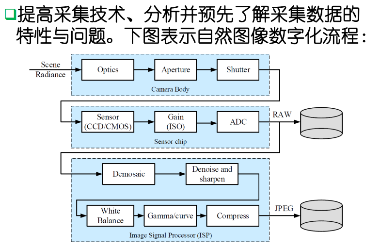

### 二维连续傅里叶变换 (fft)

二维连续傅里叶变换可以理解为一维连续傅里叶变换的张量积，或理解按照两个方向分别作一次一维傅里叶变换。
$$
F(u,v) = \int_{-\infty}^{\infty} \int_{-\infty}^{\infty} f(x,y)e^{-j2\pi(ux+vy)} dxdy
$$
其中 $(x,y)$ 表示时间域的位置，$(u,v)$ 代表频率域的坐标。此定义可以获取二位函数或图像 $f(x,y)$​ 的频率分析。

逆变换定义为：
$$
f(x,y) = \int_{-\infty}^{\infty} \int_{-\infty}^{\infty} F(u,v)e^{j2\pi(ux+vy)} dudv
$$

### 采样定律

> 知道含义，分析的是离散图像带有的一个**连续函数**。

**奈奎斯特采样定律**：如果 2D 信号 $f(x,y)$ 的傅里叶频谱 $F(u,v)$ 满足
$$
F(u,v) = \left\lbrace\begin{array}{ll}
    	F(u,v) & |u| \leqslant U_C,\ |v| \leqslant |V_c| \\
    	0  & |u| > U_C,\ |v| > |V_c|
    \end{array}
    \right.
$$
即傅里叶频谱的**支撑集有界（紧支撑集）**，则当采样周期$\Delta x, \Delta y$ 满足 $\frac{1}{\Delta 𝒙} = u_s \geqslant 2U_c$ ，$\frac{1}{\Delta y} = v_s \geqslant 2V_c$ 时，采样信号 $f(m\Delta x, n\Delta y)$ 能唯一的恢复原图像信号 $f(x, y)$。

当二维连续函数可以完美重构时，可以由下列公式通过有限采样数据进行任一点的函数值重构：
$$
f(x,y) = \sum\limits_{m=-\infty}^{\infty} \sum\limits_{n=-\infty}^{\infty} f(m\Delta x, n\Delta y) \frac{\sin \frac{\pi}{\Delta x}(x-m\Delta x)}{\frac{\pi}{\Delta x}(x-m\Delta x)} \cdot \frac{\sin \frac{\pi}{\Delta y}(y-m\Delta y)}{\frac{\pi}{\Delta y}(y-m\Delta y)}
$$
连续函数的傅里叶变换值可以由下列函数重构：
$$
F_p(u,v) = \Delta x\Delta y \sum\limits_{m=-\infty}^{\infty} \sum\limits_{n=-\infty}^{\infty} f(m\Delta x, n\Delta y) e^{-j2\pi (m\Delta xu + n\Delta yv)}
$$

#### 图像非统一采样和量化策略

> 边界区域用少的灰度级是因为由于变化剧烈，很少的灰度级也能被观测到。而如果在内部区域很少的灰度级就会变成常数。

在灰度级变化尖锐的区域，**用细腻的采样**，在灰度级比较平滑的区域，用粗糙的采样。**在边界附近使用较少的灰度级**。剩余的灰度级可用于灰度级变化比较平滑的区域，避免假轮廓现象。

---

### 图像的基本运算

- 点运算：即逐点将原有图像映射到新值。
- 反转变换：$s = (L-1) - r$ 

$[0,L-1]$ 为图像的灰度级，使得黑的变白，白的变黑

- 对数变换：$s = c\log (1+r)$

$c$ 是常数，$r\geqslant 0$。有时原图的动态范围太大，**超出某些设备的允许动态范围**，如果直接使用原图则可以丢失一部分细节。故而对原图进行灰度压缩，例如对数变换就能解决问题。

- 幂次变换：$s = cr^{\gamma}$ 例如核磁共振图像需要$\gamma<1$变亮，而航拍需要降低灰度级使图像变暗。

$c$ 和 $\gamma$ 是正常数，$\gamma < 1$提高灰度级，在正比函数上方，使得图像变亮。$\gamma>1$ 降低灰度级，在正比函数下方，使得图像变暗。**(注意这里的基本运算都是 double 形，所以取值为$[0,1]$)**

- 对比度拉伸：提高图像处理时灰度级的动态范围。
- 位平面运算：实例，图像加密 $A = A - \text{mod}(A,2) + \text{uint8}(B)$​  

> 位平面运算：最低位进行图像加密，鲁棒性差

- 通过对特定位提高亮度， 改善图像质量
- 较高位（如前4位） 包含大多数视觉重要数据 
- 较低位（如后4位） 对图像中的微小细节有作用
- 分解为位平面， 可以分析每一位在图像中的相对重要性

### 图像间的代数运算

> 可能会出简答题

- 加法，去除叠加性噪声（堆栈），生成图像叠加效果

$g(x,y)= \alpha f(x,y) + \beta h(x,y)$ 其中 $\alpha + \beta = 1$。可以得到各种图像合成的效果，也可以用于两张照片的衔接。

- 减法：显示两幅图像的差异，去除不需要的叠加性图案。
- 乘法：图像的局部展示，用二值蒙版，图像与原图像做乘法
- 非：获得反色图或补图 $g(x,y) = 255 - f(x,y)$
- 与：求两个子图像的相交子图
- 或：合并子图像
- 异或：获得相交子图像

---

### 离散卷积

> 知道原理。图像的滤波关注的两个部分
>
> 1. 卷积滤波核。
>    - 均值滤波：非负，核为 $1$。亦称为低通滤波。滤掉高频部分，让低频部分通过。
>    - 有正有负，核为 $0$，高通滤波，也是某种差分形式。
> 2. 边界延拓条件。0延拓：好算，不符合实际。复制延拓等。

已知 $a = [a_1,a_2,\cdots, a_n]$，$b = [b_1,b_2,\cdots, b_m]$，$conv(a,b)$ 将返回 $a*b$ 的向量，即
$$
(a*b)_k = \sum\limits_{i=1}^{k-1} a_i b_{k-i},\quad 2\leqslant k\leqslant m+2
$$
$\forall i>n$，$a_i = 0$，$\forall j>m$，$b_j = 0$​。

conv(a,b,'same') 将返回一个长度等于 $n$ 的卷积结果，即截取上述卷积结果中间 $n$ 个元素的结果，<span style="color: red;">**常用于信号或图像处理问题**</span>。若3个选2个，则默认选择后两个。

conv(a,b,'valid') 将返回一个长度等于 $n-m-1$ 的卷积结果，<span style="color: red;">**即仅包含 $b$ 的全部元素参与卷积的中间项**</span>。

conv2 为二维离散卷积的定义形式，在图像卷积特别是深度学习之中，图像的大小一般很大，卷积核的大小很小，所以使用same关键字的卷积方式往往更为常见

#### 图像卷积的延拓条件

- 复制性边界条件，即用边界的值代替外面的值，例如$[1,2,3,4,5]$，右侧均为$5$。
- 对称性边界条件，有利于傅里叶变换和预选变化的解释，即12345 54321
- 周期性边界条件最有利于傅里叶变换的解释，但往往不合实际，即 12345 12345

---

## 第四课：图像的傅里叶变换

> 不会过分考察数学，主要考察**离散傅里叶变换**，相比于定义更可能考察性质。fourier模长亦称为频谱。

> 求 $f(x,y) =  \left\lbrace\begin{array}{ll}
>     	A & 0\leqslant x\leqslant X,\ 0\leqslant y\leqslant Y \\
>     	0  & otherwise
>     \end{array}
>     \right.$ 的傅里叶变换

*Proof.* 
$$
\begin{align}
F(u,v) &= \int_{-\infty}^{\infty}\int_{-\infty}^{\infty} f(\alpha,\beta) e^{-j2\pi(u\alpha + v\beta)} d\alpha d\beta = A \int_{0}^{X}e^{-j2\pi u\alpha} d\alpha \int_{0}^{Y} e^{-j2\pi v\beta} d\beta \\
&= A\cdot \frac{e^{-2\pi ju X} - e^0}{-2j\pi u} \cdot \frac{e^{-2\pi jv Y} - e^0}{-2j\pi v} \\
& = AXY \cdot \frac{e^{\pi ju X} - e^{-\pi ju X}}{2j\pi u} \cdot \frac{e^{\pi jv Y} - e^{-\pi jv Y}}{2j\pi v}\cdot e^{-j\pi (uX + vY)}
\end{align}
$$
 其幅度谱为
$$
|F(u,v)| = AXY \left|\frac{\sin(\pi uX)}{\pi uX}\right|\left|\frac{\sin(\pi vY)}{\pi vY}\right|
$$

### 二维离散傅里叶变换

- 尺寸为 $M\times N$ 的离散图像函数的 DFT

$$
F(u,v) = \frac{1}{MN} \sum\limits_{x=0}^{M-1} \sum\limits_{y=0}^{N-1} f(x,y) e^{-j2\pi(ux/M + vy/N)}
$$

- 反变换也可以对 $F(u,v)$​ 求 **IDFT** 得到

$$
f(x,y) = \sum\limits_{x=0}^{M-1} \sum\limits_{y=0}^{N-1} F(u,v) e^{j2\pi(ux/M + vy/N)}
$$

- 实部与虚部
- 模定义为 $|F(u,v)|$，相位角。

- 几个基本形式

  - 线性性质
  - 变换可分性。**逐行逐列分别作1维傅里叶变换。**

  $$
  DFT[f(x,y)] = F_x\{F_y[f(x,y)]\} = F_y\{F_x[f(x,y)]\}
  $$

  

  -  周期性
    $$
    f(x,y) = f(x+mM,y+nN),\quad n,m\in\mathbb{Z}
    $$

  - 平均值性质，即低频系数
    $$
    F(0,0) = \frac{1}{MN}\sum\limits_{x=0}^{M-1} \sum\limits_{y=0}^{N-1} f(x,y)
    $$
    
  - 180度旋转性质，原图怎么旋转，fourier变换就怎么旋转。
    $$
    DFT\{DFT[f(x,y)]\} = f(-x,-y)
    $$

### 一维离散傅里叶变换的简单模拟

设 $f(x,y) =  \left\lbrace\begin{array}{ll}
 	A & 0\leqslant x\leqslant X,\\
 	0  & otherwise
 \end{array}
 \right.$ ，$X\geqslant N$ ，则
$$
F(u) = \frac{1}{N} \sum\limits_{x=1}^N A e^{-j2\pi x u/N} = \left\lbrace\begin{array}{ll}
 	A & u=0,\\
 	0  & otherwise
 \end{array}\right.
$$
即由于圆周上的点互相抵消，最终结果为 $0$ 。

而再设 $f(x,y) =  \left\lbrace\begin{array}{ll}
 	A & 0\leqslant x\leqslant X,\\
 	0  & otherwise
 \end{array}
 \right.$ ，$X< \frac{N}{2}$ ，且 $X$​ 为整数，则
$$
F(u) = \frac{1}{N} \sum\limits_{x=1}^X A e^{-j2\pi x u/N}
$$
而 $F(u)$ 在 $[0,N]$ 左右对称。

### 连续与离散傅里叶变换的联系

> 不太会直接考。

<span style="color: red;">**由于连续傅里叶变换幅度不符合奈奎斯特采样定律，故而离散傅里叶变换只能近似反应连续傅里叶变换的结果。在 MATLAB 中，定义**</span>
$$
F(u,v) = \sum\limits_{x=1}^m \sum\limits_{y=1}^n f(x,y) e^{\frac{-2\pi j(x-1)(u-1)}{m} + \frac{-2\pi j(y-1)(v-1)}{n}}
$$
其中 $1\leqslant u\leqslant m$ ，$1\leqslant v\leqslant n$ ，特别的<span style="color: red;">**当 $(u,v) = (1,1)$ 的时候，$F(1,1) = \sum\limits_{x=1}^m \sum\limits_{y=1}^n f(x,y)$ 称为离散傅里叶变换的低频系数，其余系数称为高频傅里叶系数**</span>。离散傅里叶逆变换定义如下：
$$
F(u,v) = \frac{1}{mn} \sum\limits_{u=1}^m \sum\limits_{v=1}^n F(u,v) e^{\frac{2\pi j(x-1)(u-1)}{m} + \frac{2\pi j(y-1)(v-1)}{n}}
$$
同样 $1\leqslant x\leqslant m$，$1\leqslant y\leqslant n$

- <span style="color: red;">满足周期延拓性质的图像平移后，傅里叶变换的模保持不变。</span>

### 分片二维离散傅里叶变换

实际的自然图像，大都在整体区域上不满足恒为常值，也不满足具有周期纹理状的统一分布。但是往往在局部分片上满足相应形式，因此， 分片傅里叶变换就有了很大的存在和利用价值。  

### 离散卷积定理

将两个函数都用右下补零的方法即可延拓，则它们的离散卷积为 $f_e(x,y)$ 和 $g_e(x,y)$，则：
$$
	f_e(x,y) * g_e(x,y) = \sum\limits_{m=0}^{M-1} \sum\limits_{n=0}^{N-1} f_e(m,n) g_e(x-m,y-n)
$$
则卷积定理为：
$$
DFT[f_e(x,y) * g_e(x,y)] = F_e(u,v) \cdot G_e(u,v)
$$
注意：进行零延拓不仅仅是为了让傅里叶变换可以直接定义乘法，而且可以解决卷积的边界问题， <span style="color: red;">$f(x,y)$ 与 $g(x,y)$ 一般并不满足周期性</span>，零延拓可以避免产生交叠误差，在更大的 $M\times N$ 的矩阵大小确保卷积定理成立。  

### 离散傅里叶变换的其他性质

- 比例性质：$f(ax,by) \Longleftrightarrow\ \frac{1}{|ab|} F\left(\frac{u}{a}, \frac{v}{b}\right)$ 
- 频率域卷积性质：$f_e(x,y)*g_e(x,y) \Longleftrightarrow\ F_e(x,y)\cdot G_e(u,v)$
- **平移性质**：$f(x,y) e^{2\pi j\left( \frac{u_0x}{M} + \frac{v_0y}{N}\right)} \Longleftrightarrow\ F(u-u_0,v-v_0) $
- 差分性质：结合傅里叶变换的平移性质，差分的本质就是傅里叶变换乘以某个固定的复数

>  三角函数最容易具有稀疏性。

>  **只需要记住**

$$
	F(a*b) = F(a) \cdot F(b)
$$


## 第五课：图像的其他变换

### 一维离散余弦变换

任何实对称函数的傅里叶变换中只含余弦项，余弦变换是傅里叶变换的特例，余弦变换是简化DFT的重要方法。将一个信号通过对折延拓成实偶函数， 然后进行傅里叶变换，我们就可用2N点的DFT来产生N点的DCT。

1. 以 $x=-\frac{1}{2}$ 为对称轴折叠原来的实序列 $f(n)$
2. 以 $2N$ 为周期将其周期延拓，得到

$$
f_c(2k\pi + n) = f_c(n),\quad -N\leqslant n<N
$$

为了计算方便，我们取 $n\in[0,2N-1]$ 的一个周期来进行离散傅里叶变换的计算，其模可以用余弦表示：
$$
\begin{align}
		F(u) &= \frac{1}{2N} \sum\limits_{x=0}^{2N-1} f_c(x) \cdot e^{-\frac{\pi j u x}{N}} = \frac{1}{2N}\left(\sum\limits_{x=0}^{N}f_c(x) \cdot e^{-\frac{\pi j u x}{N}} + \sum\limits_{x=N+1}^{2N}f_c(x) \cdot e^{-\frac{\pi j u x}{N}} \right) \\
		&=  \frac{1}{2N} \left( \sum\limits_{x=0}^{N}  f_c(x) \cdot e^{-\frac{\pi j u x}{N}} + \sum\limits_{x=N+1}^{2N} f_c(2N - 1 - x) \cdot e^{-\frac{\pi j u (2N - 1 - x))}{N}} \right) \\
		& =  \frac{1}{2N}\sum\limits_{x=0}^{N} f_c(x) \left(e^{-\frac{\pi j u x}{N}} +  e^{-\frac{\pi j u (2N - 1 - x))}{N}} \right) \\
		& = \frac{1}{2N} \sum\limits_{x=0}^{N} f_c(x) \left(\cos\left(-\frac{\pi u x}{N}\right) + j\sin\left(-\frac{\pi u x}{N}\right) +  \cos\left(-\frac{\pi u (2N - 1 - x)}{N}\right) + j\sin\left(-\frac{\pi u (2N - 1 - x)}{N}\right) \right) \\
		&= \frac{1}{N} e^{-\frac{\pi(2N-1)ju}{2N}} \sum\limits_{x=0}^{N-1} f_c(x)\cdot \cos \left(\frac{\pi j u(2N-1-2x)}{2N}\right)
	\end{align}
$$
其逆变换定义为：
$$
	f(x) = \sqrt{\frac{2}{N}} \sum\limits_{k=0}^{N-1} C(k) F(k) \cos\left[\frac{\pi}{N}\left(x + \frac{1}{2} \right) \right]
$$
其中
$$
c(k) = \left\lbrace\begin{array}{ll}
	\frac{1}{\sqrt{2}}, &\ k = 0\\
	1, & \ 1\leqslant k \leqslant N-1
\end{array}\right.
$$

### 二维离散余弦变换

- 二维离散余弦变换同样是可分的  

- 离散余弦变换对于图像向量是一个正交变换。变换矩阵的转置即逆变换。

#### MATLAB 版二维离散余弦变换

$$
\color{red} C(u,v) = a(u)b(v) \sum\limits_{x=1}^m \sum\limits_{y=1}^n f(x,y)\cos\frac{(2x-1)(u-1)\pi}{2m} \cos\frac{(2y-1)(v-1)\pi}{2n}
$$

其中$1\leqslant u\leqslant m$，$1\leqslant v\leqslant n$。其中
$$
\color{red} a(u) = \left\lbrace\begin{array}{ll}
	\frac{1}{\sqrt{m}}, &\ u = 1\\
	\frac{2}{\sqrt{m}}, & \ u\neq 1
\end{array}\right. ,\quad b(v) = \left\lbrace\begin{array}{ll}
	\frac{1}{\sqrt{n}}, &\ v = 1\\
	\frac{2}{\sqrt{n}}, & \ v\neq 1
\end{array}\right.
$$
当$(u,v) = 1$，$C(1,1) = \frac{1}{\sqrt{mn}}\sum\limits_{x=1}^m \sum\limits_{y=1}^n f(x,y)$ 称为离散余弦变换的<span style="color: red;">低频系数</span>，其余称高频。

### 二维离散沃尔什——哈达玛变换  

- 沃尔什函数是一组矩形波，取值为 $1$ 和 $-1$​ 
- 沃尔什函数有三种排列或编号方式，以哈达玛排列最便于快速计算。
- 采用哈达玛排列的沃尔什函数进行的变换称为沃尔什-哈达玛变换，简称 WHT 或直称哈达玛变换

- 哈达玛矩阵：元素仅由 $+1$ 和 $－ 1$ 组成的正交方阵。
- 正交方阵：指它的任意两行（或两列）都彼此正交，或者说它们对应元素之和为零。 这一点和余弦变换相同。
- 哈达玛变换要求图像的大小为 $N＝ 2^n $
- 一维哈达玛变换核为

$$
g(x,u) = \frac{1}{N} (-1)^{\sum\limits_{i=0}^{n-1} b_i(x)b_i(u)}
$$

其中，$b_k(z)$ 代表 $z$ 的二进制表示的第 $k$ 位值。 

#### 哈达玛变换

> 记住递推式！！

- 一维哈达玛正变换为：$H(u) = \frac{1}{N} \sum\limits_{x=0}^{n-1} f(x) (-1)^{\sum\limits_{i=0}^{n-1} b_i(x)b_i(u)} $ 
- 一维哈达玛反变换为：$f(x) = \sum\limits_{u=0}^{n-1} H(u) (-1)^{\sum\limits_{i=0}^{n-1} b_i(x)b_i(u)}$ 
- 二维哈达玛正反变换为  

$$
\begin{align}
		H(u,v) & = \frac{1}{N} \sum\limits_{x=0}^{N-1} \sum\limits_{y=0}^{N-1} f(x,y) (-1)^{\sum\limits_{i=0}^{n-1} [b_i(x)b_i(u) + b_i(y)b_i(v)]} \\
		f(x,y) &= \frac{1}{N} \sum\limits_{x=0}^{N-1} \sum\limits_{y=0}^{N-1} H(u,v) (-1)^{\sum\limits_{i=0}^{n-1} [b_i(x)b_i(u) + b_i(y)b_i(v)]} 
	\end{align}
$$

- 二维哈达玛正、反变换也具有相同形式  
- 正反变换都可通过两个一维变换实现  
- 高阶哈达玛矩阵可以通过如下方法递推求得  

$$
H_N = \left[\begin{array}{cc}
	H_{N/2} & H_{N/2} \\
	H_{N/2} & -H_{N/2}
\end{array}\right]
$$

- $N= 2$ 的最简单哈达玛矩阵为 **记住**

$$
H_2 = \left[\begin{array}{cc}
	1 & 1 \\
	1 & -1
\end{array}\right]
$$

- 每一个 $1,-1$ 的交错信号，我们称符号从左到右变化的次数为列率。
- 哈达玛变换矩阵，其列率排列是无规则的。
- 将无序的哈达玛核进行列率的排序，就称为**有序沃尔什（Walsh）变换**，其系数可以反映图像频率。列率即为正负号变化的次数，例如 1 -1 1 -1 ，其中变换了三次，相应的就会放在 $N = 4$​ 的最下面。

> 1. Walsh变换每个系数都是 $\pm 1$，只是排列顺序不一样，且都是可逆的也都是等价的，稀疏性毫无区别。

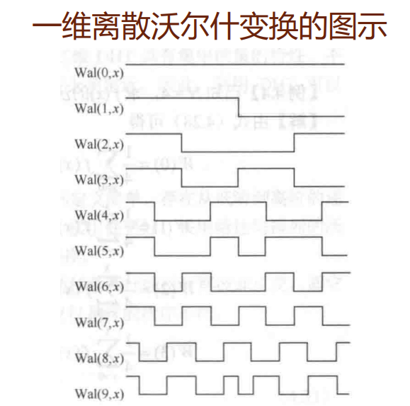

- 二维沃尔什变换和哈达玛变换都是可分的。

- 二维沃尔什变换的矩阵形式可以理解为 $W = \frac{1}{N^2} GfG$
- 二维沃尔什逆变换矩阵形式为 $f= \frac{1}{N^2} GWG$

#### 例子

考虑 $N = 4$ 的沃尔什变换

哈达玛核为
$$
H = \left[\begin{array}{cccc}
	1 & 1 & 1 & 1\\
	1 & -1 & 1 & -1\\
	1 & 1 & -1 & -1 \\
	1 & -1 & -1 & 1
\end{array}\right]
$$
而后我们恰好来练习一下如何计算列率，注意到列率从上到下依次为0,3,1,2，故而排序后得到沃尔什变换
$$
G = \left[\begin{array}{cccc}
	1 & 1 & 1 & 1\\
	1 & 1 & -1 & -1 \\
	1 & -1 & -1 & 1 \\
	1 & -1 & 1 & -1
\end{array}\right]
$$
而后我们作用在 $f$ 上得到
$$
\begin{align}
	W(0) &= \frac{1}{4} \left[f(0) + f(1) + f(2) + f(3) \right] \\
	W(2) &= \frac{1}{4} \left[f(0) + f(1) - f(2) - f(3) \right] 
\end{align}
$$

### 哈尔变换

> 只记住性质。对一张图做其他变换，例如flourier或DCT反映的是图像总体的特征，而对于研究局部变换，我们需要做局部的fourier或DCT变换，但小波变换本身就是基于局部性进行分析的。

哈尔变换的定义是基于**哈尔函数系** $\text{har}(2^p + n,t),\ p = 1,2,\cdots,\ n = 0,1,\cdots, 2^p- 1$ 的函数内积来定义的。哈尔函数的参数 $p$ 代表收缩情况，$t$ 代表整数平移情况。

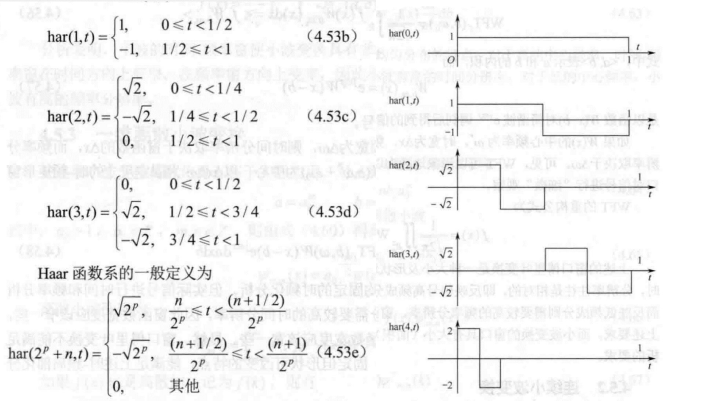

### 加窗傅里叶变换

即连续函数的**局部傅里叶变换**，设定实值偶函数$W(x)$，通常有紧支集，并定义加窗傅里叶变换为
$$
\text{WFT}_f(b,\omega) = \frac{1}{\sqrt{2\pi}} \int_{\mathbb{R}} f(x)W^*(x-b)e^{-j\omega x} dx
$$
其中 $\omega$ 为频率域自变量，$b$ 代表平移量。`WFT`也称为**短时傅里叶变换**。离散化之后对一维信号可以用于声音音调识别，对二维图像还可以进行局部分析。

> 缺点是窗口的大小不能改变，有点事可以平移选择多个窗口分别进行频率分析。光滑性鱿鱼哈尔变换但是变换的结构性不如哈尔变换。

### 一维连续小波变换

基于**加窗傅里叶变换**。为了增加不同的伸缩等级，即可定义面向连续函数的小波变换。

首先定义小波母函数 $\psi(x)$，满足条件 $C_{\psi} = \int_{\mathbb{R}} \frac{|\hat{\psi}(\omega)|}{|\omega|} d\omega < \infty$ 且 $\color{red}{\hat{\Psi}(0) = 0}$，其中 $\hat{\psi}(\omega)$ 为 $\psi(x)$ 的傅里叶变换。而哈尔变换就是特殊的小波变换，即哈尔函数即为小波母函数。*这里ppt表述有误*

定义小波母函数后，可定义小波函数族 $\psi_{a,b}(x) = |a|^{-\frac{1}{2}} \psi\left(\frac{x-b}{a}\right)$，其中 $a$ 为伸缩因子，$b$ 为平移因子。分别与 $L^2$ 函数 $f$ 计算内积，即定义了如下的小波变换：
$$
W_f(a,b) = \langle f,\psi_{a,b}(x)\rangle = |a|^{-\frac{1}{2}} \int_{\mathbb{R}} f(x)\psi^{*}\left(\frac{x-b}{a}\right) dx
$$
*这里的等号在ppt中表述有误*

而将连续小波变换中的参数 $a,b$ 进行可列个点的取值，即可构成离散小波变换。设 $a = a_0^m$，$b = nb_0a_0^m$，其中 $a_0>1$ ，$b_0\in\mathbb{R}$，$m,n\in\mathbb{Z}$。更常见的以 $a_0 = 2$，$b_0 = 1$。则小波函数族和小波变换分别表示为：
$$
\begin{align}
	\psi_{m,n}(x) &= 2^{-\frac{m}{2}} \psi(2^{-m} x - n ) \\
	W_{m,n} &= \int_{-\infty}^{\infty} f(x)\psi^*_{m,n}(x) dx = \langle f(x),\psi_{m,n}(x)\rangle
\end{align}
$$
若函数 $f(x)$ 离散定义在整数点，则 $W_{m,n} = \sum\limits_k f(k)\psi^*_{m,n}(k)$ 。这种方式往往理解成 $f(k)$ 定义成了某些狄拉克函数及其平移的线性组合所构成的特殊函数（泛函）。

若 $\psi_{m,n}$ 可以构成正交基，逆变换即可定义为
$$
f(k) = \sum\limits_{m,n} W_{m,n}\psi_{m,n} = \sum\limits_{m,n} \langle f,\psi_{m,n} \rangle\psi_{m,n}
$$

### 二维离散小波变换 DWT

> 这里的 L 即为低频， H 即为高频。低频反应图像大致的情况。

- 二维离散小波变换通常是通过张量积的方式由横、纵两个方向的小波变换结合而成，并可定义其逆变换。
- 二维离散小波变换的离散化形式可以直接理解并应用于图像矩阵的处理。
- 尺度函数的一维形式并不唯一，可以是矩形脉冲函数、山形函数或其他高次的B样条函数等等

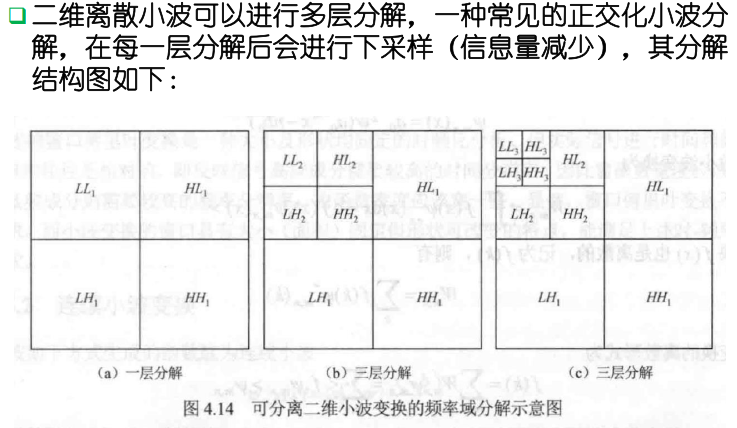

## 第六课：图像的数字水印与编码

> 基于位平面运算的数字水印 **鲁棒性不好** 水印容易被简单的滤波算法模糊化甚至消除

### 衡量标准

- 不可见性：不会引起明显的降低质量，不易被察觉
- 鲁棒性：经历多种信号处理过程中，数字水印仍能保持完整性或被准确识别

### 分类

- 水印的特性：鲁棒数字水印和脆弱数字水印
- 水印的检测过程：明文水印和盲水印
- 水印内容：有意义水印和无意义水印
- 隐藏位置：时域水印、频率域水印、时空域数字水印

### 一般步骤

**嵌入、传播和抽取**

### LSB 方法

任何一幅图片都具备一定的容噪性，像素数据的最低有效位（LSB）对人眼的视觉影响很小，秘密信息就隐藏在图像每一个像素的最低位或次低位，实现不可见性。  

> 对于256色灰度图像，隐藏在第八位（最低有效位）

把水印分别嵌入到图像像素的不同位，越低位嵌入，人眼越难识别

### DCT 域加入水印方法

先计算DCT，然后将水印叠加到叠加到DCT域中幅值最大的前k系数上(不包括直流分量)，通常为图像的低频分量。若DCT系数的前k个最大分量表示为 $D = \{d_i\}$，水印服从高斯分布的随机实数序列 $W = \{w_i\}$，那么水印的嵌入算法为：
$$
\color{red}{D_i = d_i(1 + \alpha w_i)}
$$
用新的系数做反变换即可得到水印图像 $I_w$。

考虑 $\alpha  = 2$ 的情况

```matlab
Ac = dct2(A), Bc = dct2(B);
ind = abs(Ac) >= 100;
Ac(ind) = Ac(ind) + 2 * Bc(ind);
A_revised = idct2(Ac);
B_revised = dct2(uint8(A_revised)) - Ac;
```

### 基于DWT的数字水印方法

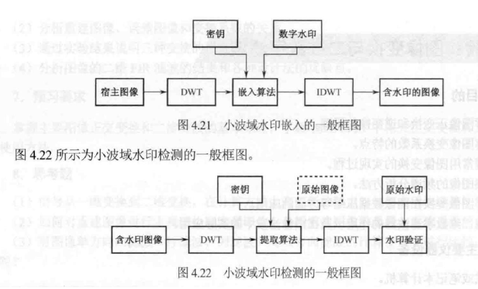

### 数据编码与数据压缩  

数据编码：信息保密、信息的压缩存储与传输

数据压缩：以较少的数据量表示信源以原始形式所代表的信息，目的在于节省存储空间、传输时间、信号频带和发送能量等。


#### 信息熵

- 代表信源所含的平均信息量。
- 若信源编码的熵大于信源的实际熵，则信源中的数据一定存在冗余度冗余数据的去除不会减少信息量。
- 信息量与数据量的关系可由下式表示

$$
I = D - du
$$

其中，$I,D,du$ 分别表示信息量、数据量和冗余量  

### 图像数据量的完整表示

$$
V = w\cdot h\cdot d/8
$$

$V,\ w,\ h,\ d$​ 分别表示图像数据量（字节，byte，B） 、图像宽度（像素数，pel）、图像高度（像素数，pel） 、图像深度（位， bit）  

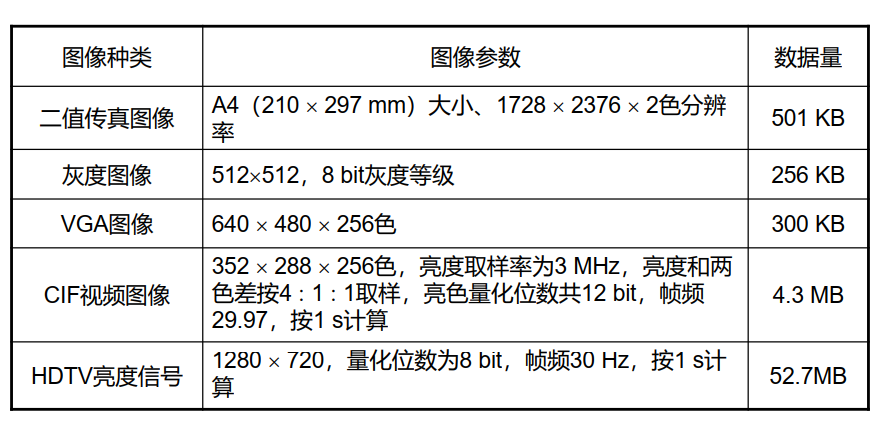

### 压缩编码的可行性

一般图像中存在着以下数据冗余因素:

-   编码冗余信息编码存在大量的重复子结构或其他冗余结构
- 像素间的相关性形成的冗余自然图像普遍呈分片光滑状，可以“成片”表示
- 视觉特性和显示设备引起的冗余
- 人眼对小的误差不敏感，用于有损压缩

#### 图像熵：

假定图像的灰度级为 $x_i$，且 $x_i$ 出现的概率为 $p(x_i)$，则图像熵可以定义为
$$
\color{red}{H(x) = -\sum\limits_{i=1}^M p(x_i)\log_2 p(x_i)}
$$
图像熵值在 $p(x_i) = 1/M$ 时达到最大值 $\log_2 M$，在所有灰度全部取相同值的时候达到最小值 $0$，因此熵值反映了图像或编码分配的平均程度。而当 $M = 2^L$ 时，可以定义平均码长
$$
R(x) = \sum\limits_{i=1}^M p(x_i) L_i
$$
$L_i$ 表示分配给灰度级 $x_i$ 的码字的长度。（例如用Huffman编码等）

### 技术指标

- 图像冗余度与编码效率：图像冗余度 $r = 1- \frac{H(x)}{R(x)}$ ，而定义 $\eta = \frac{H(x)}{R(x)} = \frac{1}{1+r}$​ 为编码效率。
- 压缩比：定义为平均码长的比例 $C_r = \frac{\bar{r}_b}{\bar{r}_c}$，也可以理解为总码长的比例，或者是总的空间占有的比例。
- 客观保真度评价：用于有损压缩，均方误差以及信噪比SNR，峰值信噪比PSNR。

### Huffman 编码

优点：

- 实现Huffman编码的基础是统计源数据集中各信号的概率分布。
- Huffman编码在无失真的编码方法中效率优于其他编码方法（平均码长最短） ，是一种最佳变长码，其平均码长接近于熵值。

#### 缺点：

- 当信源数据成分复杂时，庞大的信源集致使Huffman码表较大，码表生成的计算量增加，编译码速度相应变慢
- **不等长编码**致使硬件译码电路实现困难。上述原因致使Huffman编码的实际应用受到限制

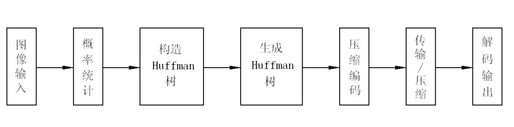

### 香农编码

Shannon提出了将信源符号依其概率降序排列，用符号序列累积概率的二进制表示作为对信源的唯一可译编码。

其应用于图像编码的步骤如下：

1. 将N个灰度级 $x_i$ 按其概率递减进行排列。
2. 求概率分布 $p_i$ 的第 $i$ 个灰度级的二进制位数 $n_i$。

$$
-\log_2 p_i \leqslant n_i \leqslant -\log_2 p_i + 1
$$

3. 计算与 $p_i$ 相对应的累积概率 $P_i$ , 把与 $P_i$ 相对应的二进码和接下去与 $p_k\ (k>i)$ 相应的码相比较，前面的 $n_i$ 位至少有一位以上的数字是不同的。

### Shannon 编码原理

Shannon 编码是一种基于信息论的编码方法，它根据每个符号的概率分布来确定码字的长度。一般来说，概率较高的符号会分配较短的码字，概率较低的符号会分配较长的码字，以达到压缩数据的目的。下面是具体的步骤和示例推导。

#### Shannon 编码步骤：

1. **计算累积概率**：
   对于每个符号，计算其出现概率的累积概率 $ P_i $。

2. **确定位数**：
   根据符号的概率 $ p_i $，计算其码字的长度 $ L_i = \lceil -\log_2 p_i \rceil $。

3. **生成码字**：
   对于每个符号 $ x_i $，确定其码字是累积概率 $ P_i $ 的前 $ L_i $ 位二进制表示。

#### 具体示例推导

假设有一信源，其符号集 $ x_i $ 及其概率分布如下：

| 符号 $ x_i $ | 概率分布 $ p_i $ | 累积概率 $ P_i $ | 位数 $ L_i $ | 编码 |
| ------------ | ---------------- | ---------------- | ------------ | ---- |
| $ x_1 $      | 0.40             | 0                | 2            | 00   |
| $ x_2 $      | 0.20             | 0.40             | 3            | 011  |
| $ x_3 $      | 0.12             | 0.60             | 4            | 1001 |
| $ x_4 $      | 0.11             | 0.72             | 4            | 1011 |
| $ x_5 $      | 0.09             | 0.83             | 4            | 1101 |
| $ x_6 $      | 0.08             | 0.92             | 4            | 1110 |

#### 1. 计算累积概率 $ P_i $：

累积概率 $ P_i $ 是符号 $ x_i $ 及之前所有符号出现概率的累积和。我们从第一个符号开始逐一计算：

- $ P_1 = 0 $ 
- $ P_2 = 0 + 0.40 = 0.40 $
- $ P_3 = 0.40 + 0.20 = 0.60 $
- $ P_4 = 0.60 + 0.12 = 0.72 $
- $ P_5 = 0.72 + 0.11 = 0.83 $
- $ P_6 = 0.83 + 0.09 = 0.92 $

#### 2. 确定位数 $ L_i $：

对于每个符号，位数 $ L_i $ 通过计算其概率 $ p_i $ 的负对数并取上整数：

- $ L_1 = \lceil -\log_2 0.40 \rceil = 2 $
- $ L_2 = \lceil -\log_2 0.20 \rceil = 3 $
- $ L_3 = \lceil -\log_2 0.12 \rceil = 4 $
- $ L_4 = \lceil -\log_2 0.11 \rceil = 4 $
- $ L_5 = \lceil -\log_2 0.09 \rceil = 4 $
- $ L_6 = \lceil -\log_2 0.08 \rceil = 4 $

#### 3. 生成码字：

对于每个符号 $ x_i $，其码字是累积概率 $ P_i $ 的前 $ L_i $ 位二进制表示：

- $ P_1 = 0 $，前2位为 "00"
- $ P_2 = 0.40 $，前3位为 "011"
- $ P_3 = 0.60 $，前4位为 "1001"
- $ P_4 = 0.72 $，前4位为 "1011"
- $ P_5 = 0.83 $，前4位为 "1101"
- $ P_6 = 0.92 $​，前4位为 "1110"

Shannon 编码通过考虑符号概率的累积概率生成对应的码字，旨在使得平均码长尽可能接近熵值，从而达到较高的编码效率。

### 算术编码

算术编码是一种无损数据压缩算法，在信源各符号概率接近的条件下，算术编码是一种优于Huffman编码的方法。它的主要思路是利用实数（二进制小数）的方法来记录一组数据流。传输完成后再将实数恢复为数据流。

#### 算术编码的步骤：

1. **初始化区间**：
   - 算术编码通常以 $[0, 1)$ 设定为初始区间，并假设概率空间宽度 $ A_0 = 1 $，下限 $ C_0 = 0 $，上限 $ D_0 = 1 $。
   
2. **根据符号概率更新区间**：
   - 根据符号出现的概率分配子区间 $[p_{il}, p_{ih})$，对应概率值 $ p_{ih} - p_{il} $。
   - 对每一位符号 $ s_n $，更新概率空间的下限和上限值：
     $$ C_n = C_{n-1} + A_{n-1} \cdot p_{nl} $$
     $$ D_n = C_{n-1} + A_{n-1} \cdot p_{nh} $$
   - 此后将区间 $[C_n, D_n)$ 设为新的当前区间，重复迭代。

#### 算术编码示例分析

我们使用给定的信源概率分布 $ X = \begin{bmatrix} 0 & 1 \\ \frac{2}{5} & \frac{3}{5} \end{bmatrix} $ 对二进制序列 01011 进行算术编码。下面是具体的步骤和分析。

##### 信源概率分布

- 符号 0 出现的概率 $ p(0) = \frac{2}{5} $
- 符号 1 出现的概率 $ p(1) = \frac{3}{5} $

##### 编码步骤

我们根据序列 01011 来进行编码：

| Step | $ x $ | $ s $                                                        | 下限 $ C $         | 上限 $ D $        |
| ---- | ----- | ------------------------------------------------------------ | ------------------ | ----------------- |
| 1    | 0     | 0                                                            | 0                  | $\frac{2}{5}$     |
| 2    | 1     | $0 + \frac{2}{5} \times \frac{2}{5} = \frac{4}{25}$          | $\frac{4}{25}$     | $\frac{6}{25}$    |
| 3    | 0     | $\frac{2}{5} + 0 \times \frac{6}{25} = \frac{4}{25}$         | $\frac{4}{25}$     | $\frac{12}{125}$  |
| 4    | 1     | $\frac{4}{25} + \frac{2}{5} \times \frac{12}{125} = \frac{124}{625}$ | $\frac{124}{625}$  | $\frac{36}{625}$  |
| 5    | 1     | $\frac{124}{625} + \frac{2}{5} \times \frac{36}{625} = \frac{692}{3125}$ | $\frac{692}{3125}$ | $\frac{108}{625}$ |

##### 具体步骤详解

1. **初始区间**：
   - 初始化区间为 $[0, 1)$
   - 第一步编码符号 0，对应的概率为 $ p(0) = \frac{2}{5} $
   - 更新区间：
     - 下限：0
     - 上限：$\frac{2}{5}$

2. **第二步编码符号 1**：
   - 当前区间：[0, $\frac{2}{5}$)
   - 符号 1 的累积概率区间：[0.4, 1)
   - 更新区间：
     - 下限：$ 0 + \frac{2}{5} \times \frac{2}{5} = \frac{4}{25} $
     - 上限：$ 0 + \frac{2}{5} \times \frac{3}{5} = \frac{6}{25} $

3. **第三步编码符号 0**：
   - 当前区间：[0, $\frac{2}{5}$)
   - 符号 0 的累积概率区间：[0, $\frac{2}{5}$)
   - 更新区间：
     - 下限：$ \frac{2}{5} + 0 \times \frac{6}{25} = \frac{4}{25} $
     - 上限：$ \frac{4}{25} + \frac{2}{5} \times \frac{12}{125} = \frac{12}{125} $

4. **第四步编码符号 1**：
   - 当前区间：[0, $\frac{2}{5}$)
   - 符号 1 的累积概率区间：[0.4, 1)
   - 更新区间：
     - 下限：$ \frac{4}{25} + \frac{2}{5} \times \frac{12}{125} = \frac{124}{625} $
     - 上限：$ \frac{4}{25} + \frac{2}{5} \times \frac{36}{625} = \frac{36}{625} $

5. **第五步编码符号 1**：
   - 当前区间：[0, $\frac{2}{5}$)
   - 符号 1 的累积概率区间：[0.4, 1)
   - 更新区间：
     - 下限：$ \frac{124}{625} + \frac{2}{5} \times \frac{36}{625} = \frac{692}{3125} $
     - 上限：$ \frac{108}{625} $

---

## 第七课：图像压缩

### 预测编码

在某种模型的指导下，根据过去的样本序列推测当前的信号样本值，然后用实际值与预测值之间的误差值进行编码。如果模型与实际情况符合得比较好且信号序列的相关性较强，则误差信号的幅度将远远小于样本信号。

**差分脉冲编码调制/Differential Pulse Code Modulation/DPCM**

#### DPCM 系统组成结构


### 线性预测编码  <span style="color: red;">**有损**</span>

*此处 ppt 存在问题*

假设经扫描后的图像信号 $x(t)$ 是一个<span style="color: red;">**均值为零**</span>、方差为 $\sigma^2$ <span style="color: red;">**平稳随机过程**</span>。线性预测就是选择 $a_i\ (i = 1,2,\cdots,N-1)$ 使得预测值为 $x_n^{\prime} = \sum\limits_{i=1}^{N-1} a_i x_i$，并且使得差值的均方值最小。即 MSE 均方误差 $E\{e_n^2\} = E\{(x_n - x_n^{\prime})^2\}$​。

- 最小 MSE 准则，可以令对 $a_i$ 的 Partial 为 0，即 $\frac{\partial E(e_n^2)}{\partial a_i} = 0$
- 定义 $x_i$ 与 $x_j$ 的自相关函数

$$
	R(i,j) = E\{x_i,x_j\} = R(i-j) = R(j-i)
$$

写成矩阵形式为 Yule-Walker 方程组 $R(i) = \sum\limits_{k=1}^{N-1} a_k R(k-1)$ 

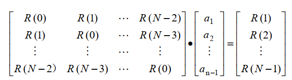

图像的相关性越强，压缩效果越好。而当某个阶数已经使得 $E\{e_N,e_{N-1}\}=0$ 时即使再增加预测点数，压缩效果也不可能继续提高。

若 $\{x_i\}$ 为平稳的 $m$ 阶 Markov 过程，则 $m$ 阶线性预测器就是在 MMSE 意义下的最佳预测期。

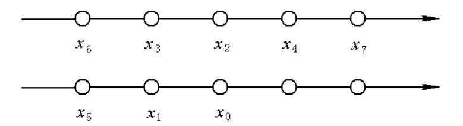

### 预测器方案

- 前值预测：用同一行的临近像素来预测，$\hat{x} = x_1$
- 一维预测：如上图的 $x_1$，$x_5$
- 二维预测
- 三维预测：用于视频压缩，还会使用前几帧的同位置或临近像素值进行预测。

### 自适应预测编码

- 自适应预测：预测参数根据信号的统计特性来确定，以达到最佳预测，适用于信号不够平稳的情况
- 预测编码的优点：直观快捷、便于实现
- 预测编码的缺点：压缩比不够高

### 变换编码

通过数学变换可以改变信号能量的分布，从而压缩信息量。

以傅里叶变换的概念说明合理的变换可以改变信号能量分布的基本原理。


### 变换编码的实现

在变换编码中有以下几个问题值得注意：

- 图像变换方法的选取
- 子图像大小的选取
- 常用的图像编码方法
  - 区域编码
  - 阈值编码 （DCT 系数小于阈值则记为0）
  - 混合编码

### 整数小波变换  <span style="color: red;">**无损**</span>

传统的 DCT 与经典小波变换在图像变换后会产生浮点数，因此必须进行量化处理。产生了失真。

新一代的整数小波变换（又叫第二代小波变换）采用提升方法能够实现整数变换，因而能够实现图像的无损压缩，显然它是一种很适合于医学等图像的压缩方法。

新的静态图像压缩标准JPEG2000中采用了基于提升方法的整数小波变换。

1. 分裂

将一原始信号序列 $s$ 按偶数和奇数分成两个较小的，互不相交的小波子集 $s_{j-1}$ 和 $d_{j-1}$

2. 预测

定义一个预测算子 $P$，用 $P(s_{j-1})$ 来预测 $d_{j-1}$，这样可以用相邻的偶数序列来预测奇数序列。也可以用平均值代替中点值。

3. 更新

构造一个 $U$ 算子来更新 $s$，使之保持原有的数据集的某些特性。

逆变换则反向运算，先更新 $s$ 再更新 $d$ 即可。

### 二值图像编码

只用白（0）和黑（1）的两个灰度级称之为二值图像。

### 跳跃空白编码  <span style="color: red;">**无损**</span>

用于0较多的图。将图像的每一条扫描线分成若干等长的段，每段有$m$个像素，一般$m=8-12$。

扫描线段可能出现的两种情况：

1. 全是0像素，这种线段称为`空白块` blank，常表示背景成分，编码时空白块用码字0表示
2. 全是1像素或者由01组成：用1加直接编码表示

### 游程长度编码RLC  <span style="color: red;">**无损**</span>

它改变连续出现相同字符的表达方式，以降低码长。一个符号代表数据，一个符号代表串长。参考数据库中此部分。

### JPEG <span style="color: red;">**有损 & 无损**</span>

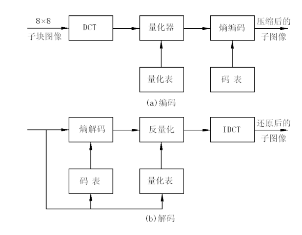

每个单独的彩色图像分量的编码算法：

1. 带压缩图像分成若干个$8\times 8$的子块，作基于子块的DCT
2. 根据最佳视觉特性构造量化表，设计自适应量化器并对DCT的频率系数进行量化
3. 为了增加连续的$0$系数的个数，对量化后的数据进行$Z$子形重排
4. Huffman码作变字长熵编码器进行编码，进一步压缩

#### 彩色空间转换问题——YCbCr表示  

YCbCr颜色空间将颜色信息分为亮度（Y）和色度（Cb和Cr）分量：

- **Y（亮度）**：表示图像的亮度信息，范围通常是16到235。
- **Cb（蓝色差）**：表示颜色信息中蓝色与亮度的差异。
- **Cr（红色差）**：表示颜色信息中红色与亮度的差异。

#### 量化—最佳的亮度量化表和色度量化表，Z字形重排

 


#### JPEG的视频应用

- 尽管JPEG标准是基于彩色静止图像压缩而提出的，但对于压缩视频的帧内图像也十分有效。每秒可处理2700万个像素的单片JPEG编/解码器芯片，已能实时处理常规电视图像。
- M-JPEG（Motion-JPEG， MPEG）技术即运动静止图像压缩技术。
- 这种技术广泛应用于可精确到帧编辑和多层图像处理的非线性编辑领域。
- M-JPEG的压缩和解压缩是**对称**的，可由相同的硬件和软件实现。

#### 压缩标准

JPEG2000还将彩色静态画面采用的JPEG编码方式与2值图像采用的JBIG编码方式（本次课不细讲，一种**无损**编码）统一起来，成为对应各种图像的通用编码方式。  

####  JPEG主要特征

<span style="color: red;">**JPEG 2000放弃了以DCT为主的区块编码方式。采用以小波转换为主的多解析编码方式**</span> 

1. 高压缩率。
2. 无损压缩和有损压缩。
3. 渐进传输。
4. 感兴趣区域压缩。
5. 码流的随机访问和处理。
6. 容错性。
7. 开放的框架结构。
8. 基于内容的描述。

#### 基本框架

1. 对原始图像进行 DWT 离散小波变换
2. 变换后的小波系数进行量化
3. 对量化后的数据熵编码
4. 最后形成输出码流

解码器是编码器的逆过程

## 第八课：图像的模式识别

### 主成分分析

对数据进行中心化，再分析自身的协方差矩阵，即$(A - \bar{A})(A - \bar{A})^T$进行特征值分解，该矩阵为对称半正定矩阵，取其最大的2-3个特征值，并获取对应特征向量上的系数，即可完成数据的降维操作。

### KNN方法

观察未知标签图像最接近的若干图像是什么标签，可以完成对未知图标签的简单估计，该方法称为 $k$ 临近（KNN）方法。

### SVM 支持向量机

更具鲁棒性。找出训练集的一个分割超平面，有很多个超平面时，需要确定一个鲁棒性最强的，即离两类的点的距离最远的。

而SVM模型通常通过下列优化问题求得：
$$
\begin{align}
		\min\limits_{\vec{w},\vec{b}} &\quad \frac{1}{2}\|\vec{w}\|^2 \\
		s.t.\quad & y_i(\vec{w}^T\vec{x}_i + \vec{b}) \geqslant 1
	\end{align}
$$

### 深度学习

在最近的十几年，深度学习几乎统治了图像的模式识别。它所使用的非线性变换，进行多层的<span style="color: red;">**（卷积+非线性激活函数）**</span>的混合操作，从而可以得到很多抽象但也难以解释数据。这些数据往往还会进行<span style="color: red;">**下采样或筛选（池化）**</span>，成为上图中的预处理数据，最终以<span style="color: red;">**线性拟合**</span>（全连接层）的方式和输出对接。卷积核的定义需要训练。  

#### 神经网络 NN 模型 

- 由若干个神经元组成的单向传播的网络
- NN中的每个神经元通常是简单的处理单元，采用一个或多个输入并产生输出。每个输入都带有一个权重，用来修改输入的强度，之后神经元将所有修改过后的输入加在一起，并通过激活函数（activation function）计算要传递给下一层神经元的输出。

#### 激活函数

- ReLU $\max(0,x)$
- Sigmoid $\sigma(x) = 1/(1 + e^{-x})$

#### 池化层

池化操作一般都伴随着数据的筛选和减少，常见的池化方法包括取最大值（最常见）、取最小值、取平均值等。

#### LeNet

LeNet最初的定义比较简单，其结构为**卷积-池化-卷积-池化-卷积-全连接**的层级结构。后续的神经网络在层级上会更加丰富，或使用了不同的卷积定义，或使用了不同的池化（数据筛选）方法。结构先走向复杂，又趋于稳定。  

## 第九课：图像增强（上）

使用图像处理算法，使观察者能够更方便的观察出图像的灰度色彩变化、整体结构框架、边界纹理细节等信息的处理方式。  

### 技术分类

- 空间域：
  - 点运算：通常建立图像灰度/颜色的一种映射，使图像根据原有灰度或颜色变成一种新的对应灰度或颜色，达到更改整体亮度/对比度/颜色风格的效果
  - 线性/仿射运算：点乘和卷积，前者灰度增强，后者平滑或锐化增强。
- 频率域增强：频率域增强往往是先用DFT或DCT转化到频率域 ，然后重复上面的操作，最后逆变换。

### 灰度增强

对比度的放缩、暗光图的增强，或对局部区域个别灰度窗口进行强化显示的增强

前述的傅里叶变换模取对数就是一种对比度减小的图像增强，旨在显示更多的系数区分度。*防止屏幕不兼容导致色彩出现问题？*

#### 朴素方法和标定方法

设理想真实的图像为 $f(i,j)$，实际获得的含噪声的为 $g(i,j)$，则有 $g(i,j) = e(i,j)f(i,j)$。$e(i,j)$ 为使理想图像发生畸变的比例因子。知道了 $e(i,j)$​ 就可以求出不失真图像。

标定系统失真系数的方法：采用一幅灰度级为常数 $C$ 的图像成像，若经成像系统的实际输出为 $g_c(i,j)$，则有 $g_c(i,j) = e(i,j)C$，可以得到比例因子 $e(i,j) = g_c(i,j)C^{-1}$ 。而后实际图像校正后即可恢复。

但是乘了一个系数，校正之后可以出现**溢出现象**。灰度级值可能超过某些记录器件或显示设备输入信号的动态可范围，需再作适当的灰度变换，最后对变换后的图像进行量化。

经灰度级校正后的图像灰度值不一定在原降质图像的量化值上，因此须对变换后的图像重新进行量化。朴素模型推广为<span style="color: red;">**Retinex模型**</span>
$$
I(x,y) = R(x,y) \times L(x,y)
$$
其中 $L(x,y)$ 为入射图像， $R(x,y)$ 为反射分量， $I(x,y)$ 为人眼观察到的反射图。 $R(x,y)$ 对应前述 $g(i,j)$。

### 灰度变换 扩展或压缩动态范围

**为了将图像灰度级的整个范围或一段范围扩展或压缩到记录或显示设备的动态范围**，使图像变得更加清晰、图像上的特征更加明显。  

灰度变换可分为**线性变换，分段线性变换、非线性变换**

 #### 线性变换

即一次函数进行插值


### 分段线性灰度变换 突出目标区间

**突出感兴趣的目标或灰度区间，相对抑制那些不感兴趣的灰度区间。常用的是三段线性变换  **

 

仔细调整折线拐点的位置及控制分段直线的斜率，可以对图像的任一灰度区间进行拉伸或压缩 。在某些应用场合，可将过黑或过白的灰度级压缩成一个灰度级。

### 非线性灰度变换 改变对比度

利用非线性函数，例如指数与对数进行变换。利用对数变换降低对比度，指数函数提高对比度
$$
	g(i,j) = a + c\log (1 + |f(i,j)|)
$$

$$
	g(i,j) = b\cdot e^{c(f-a)}
$$

##### Gamma 变换（幂次变换）

根据指数函数进行变换 $y = x^{\gamma}$ ，对于普遍暗光的图可以用 $\gamma < 1$ 实现亮度提升，过量的图利用 $\gamma > 1$。*注意这里应该是用 double 型，即在 $[0,1]$ 之间的元素，否则这里的 $\gamma$ 应取反。*

全暗图在亮度校正后，色彩饱和度往往不是很足，而且会存在比较明显的噪声或不平滑特征。  

### 图像的直方图变换 灰度间距拉开或分布均匀

直方图变换后可使图像的灰度间距拉开或使灰度分布均匀，从而增大对比度，使图像细节清晰，达到增强的目的。

- **直方图均衡化** 
  - 通过对原图像进行某种变换，使得图像的直方图变为均匀分布的直方图 。
  - 灰度级连续的灰度图像：当变换函数是原图像直方图累积分布函数（CDF） 时，能达到直方图均衡化（灰度范围[0,1]） 的目的。
  - 对于离散的图像，用频率来代替概率。利用频率构成的分布列计算累积分布函数，也可以 达到直方图均衡化（灰度范围[0,1]）的目的。

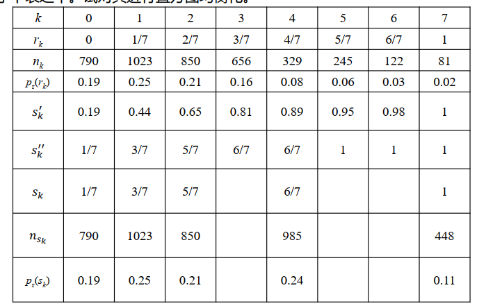

1. 求变换函数，即求累积分布函数 $s_k^{\prime}$

$$
	s_0^{\prime} = T(r_0) = \sum\limits_{j=0}^0 p_r(r_j) = \frac{790}{64*64} = 0.19
$$

类似的
$$
s_1^{\prime} = T(r_1) = \sum\limits_{j=0}^1 p_r(r_j) = \frac{790+1023}{64*64} = 0.44
$$
后文同理

2. 计算等间隔的近似灰度值 $s_k^{\prime\prime}$ 

输出图像灰度是等间隔的，且与原图像灰度范围一样取 8 个等级，即要求最终的值 $s_k = \frac{k}{7}$ 。需要对 $s_k^{\prime}$ 进行重新量化后加以修正，而后我们发现输出灰度级仅为五个级别。
$$
	s_0 = 1/7\quad s_1 = 3/7\quad s_2= 5/7\quad s_4 = 6/7\quad s_7 = 1
$$
而后计算对应每个 $s_k$ 的 $n$​

- **直方图规定化**


### 图像的同态增晰  消除不均匀照度的影响而不损失图像细节

图像由于物体受到不均匀的照度，其灰度级动态范围很大，黑与白形成强烈反差，而感兴趣目标的灰度级范围很小，分不清目标的灰度层次和细节，图像上对应照度暗的部分，其细节较难分辨。

使用灰度线性变换无法解决这类图像的增强问题：扩展灰度级虽可提高目标的反差，但会使动态范围更大；压缩灰度级，虽可减少动态范围，但目标的灰度层次和细节就会更看不清，

同态増晰:目的是**消除不均匀照度的影响而不损失图像细节。即减弱反射分量增强照明分量**

图像是物体对照明光的反射，自然景物图像是由两个分量乘积组成的，即照明函数和反射函数的乘积。**反射分量**反映图像的实际内容（细节，纹理，边缘等），随图像细节不同在空间上做快速变化，其频谱落在**空间高频区域**。而**照明分量**在空间上均具有缓慢变化的性质，其频谱落在空间**低频区域**。因此可通过**傅里叶变换**将两者分开，进行同态滤波。

#### 算法 <span style="color: red;">**本质：对数图像频率域的高通滤波**</span>  

1. 对数运算 

$$
	z(x,y) = \ln f(x,y) = \ln i(x,y) + \ln r(x,y)
$$

2. 傅里叶变换

$$
	z(u,v) = I_1(u,v) + R_1(u,v)
$$

3. 选择同态滤波特性 $H(u,v)$，<span style="color: red;">**乘以 DFT 结果**</span>。衰减 $I_1$ 以压缩 $i(x,y)$ 分量的变换范围，提升 $R_1(u,v)$ 以增强 $r(x,y)$ 细节分量的对比度。
4. 傅里叶反变换
5. 指数运算进行还原

高通滤波器也可以理解成图像减去其低通滤波结果 。减少高频系数的成为低通滤波器。

#### 另一种算法

在对数运算时加入高斯核函数
$$
	\ln R(x,y) = \ln I(x,y) - \ln(I(x,y) * F(x,y))
$$
其中，$F(x,y)$ 为高斯核函数， $I(x,y)$ 为输入图，$R(x,y)$ 为图像反射图，即进行时间域的一种均值滤波（也相当于频率域高斯核低通滤波）  

使用高斯核做滤波后进行模糊化，从而可以大致确定图像的分片亮度情况 。而后就可以得到 $R(x,y)$ 再进行上述的线性或非线性增强化。

### 反色去雾法

先将暗图用反色变成雾图，再用去雾算法（一般用 Retinex 理论或图像熵来解决），而后反色复原。

---

## 第十课：图像增强（中）

### 区域增强

区域增强算法包括**平滑算法和锐化算法**。低通滤波可对图像进行平滑处理（去掉高频部分）；高通滤波可对图像进行锐化处理（去掉低频部分）。除此之外，还有一种频率域带通滤波器（去掉太低和太高频的部分），往往可以获得某些特殊的图像特征，但在图像处理之中使用的不算多。

在时间域中也可以直接进行多种平滑算法，例如邻域平均法、中值滤波和边界保持类滤波。

### 图像噪声

数字图像要经过<span style="color: red;">**采集**</span>、处理、存储、传输等一系列加工变换。

1. 噪声分类
   - 产生原因： <span style="color: red;">**外部噪声**</span>和内部噪声
   - 统计特性是否随时间变化（一般用于视频或批量图像）：平稳噪声和非平稳噪声
   - 噪声幅度随时间分布形状来定义： <span style="color: red;">**高斯噪声**</span>、瑞利噪声、泊松噪声等
   - 噪声频谱形状来分： <span style="color: red;">**白噪声**</span>、 1/f 噪声、三角噪声
   - 按噪声和信号之间的关系：加性噪声、乘性噪声、其他噪声  
     - 加性噪声：$f + n$ 如高斯噪声、热噪声、散弹噪声、量化噪声
     - 乘性噪声：$f + nf$ 扫描光栅、胶片颗粒

泊松噪声就属于既不是加性噪声也不是乘性噪声的噪声。椒盐噪声、 CT成像金属噪声也不是这两类噪声。  

#### 高斯噪声 加性噪声

$g = f+n$，$n$ 由服从高斯分布的样本构成

#### 椒盐噪声

一种结构比较简单的冲击噪声，其含义为在图像中随机选取一定比例的像素点并将其灰度更改为黑色的0或白色的255，以达到完全破坏这些像素的效果。其余像素则保持原值不变。  

#### 泊松噪声

用泊松分布近似每一个像素的光子数，参数 $\lambda = kf \approx np$，$f$ 为图像的理想亮度，$k$ 为一较大的亮度，表示光子数与亮度之间的比值。而后设 $X\sim P(\lambda)$，获取 $x$ 的一个样本，实际亮度表示为 $g = x/k$。

故而由绝对噪声强度来讲，$k$ 一定时，<span style="color: red;">**越亮的地方噪声越强**</span>。

当 $f$ 一定时，$k$ 越大则 $D(g)$ 越小（对应近似二项分布就是样本越多频率越接近于概率），这也就说明总体光强越大，则泊松噪声影响越小。在包括CT成像等工程或医学成像之中，强光成像质量更好。 <span style="color: red;">**减弱放射光强则会增强成像噪声**</span>。

泊松噪声没有很好的理论去除方法，一种简单的操作是使用Anscombe变换，将原始图 $f$ 映射成 $\sqrt{f}$ 或 $\sqrt{f\pm 0.375}$（峰值为1），可以将噪声变为近似高斯噪声，去噪后再做逆变换。  

#### 均值滤波

空间域均值滤波：大部分的噪声都可以看作是随机信号， 对图像的影响可以看作是孤立的。某一像素， 如果它与周围像素点相比， 有明显的不同， 则该点被噪声感染了。设当前待处理像素为 $f(m,n)$， 给出一个大小为 $3× 3$ 的九点均值滤波处理模板。

设处理后的图像为 $g(m,n)$，则九点均值滤波可以描述为
$$
g(m,n) = \left\lbrace\begin{array}{ll}
    	\frac{1}{9} \sum\limits_{i\in Z}\sum\limits_{j\in Z} f(m+i,n+j) & \left|f(m,n) - \frac{1}{9} \sum\limits_{i}\sum\limits_{j} f(m+i,n+j)\right| > \varepsilon \\
    	f(m,n) & otherwise
    \end{array}\right.
$$
其中 $Z = \{-1,0,1\}$，$\varepsilon$ 为门限，若 $\varepsilon = 0$，等价于卷积操作，也称为<span style="color: red;">**低通空间滤波**</span>。而可以等价于
$$
g(m,n) = \sum\limits_{r=-k}^k \sum\limits_{s=-l}^l f(m-r,n-s)H(r,s)
$$
上述 $H(r,s)$ 称为掩模。

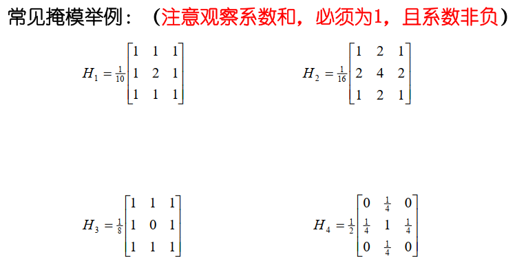

<span style="color: red;">**均值滤波不适用于反差很大的椒盐噪声 **</span>

### 中值滤波

邻域平均法在去噪时使得边界也变得模糊。而中值滤波是用非线性的处理方法，在去噪的同时可以兼顾到边界信息的保留。 选一个含有奇数点的窗口 $W$， 将这个窗口在图像上扫描， 把该窗口中所含的像素点按灰度级的升（或降） 序排列，取位于中间的灰度值，来代替该点的灰度值。  


中值滤波对于消除孤立点和线段的干扰十分有用。特别是对于二进噪声尤为有效，对于消除高斯噪声的影响效果不佳。对于一些细节较多的复杂图像，还可以多次使用不同的中值滤波，然后通过适当的方式综合所得的结果作为输出，这样可以获得更好的平滑和保护边缘的效果。对于椒盐噪声的效果不错。

### K临近均值滤波器

在 $m×m$ 的窗口中，属于同一集合类的像素，它们的灰度值将高度相关。被处理的像素（对应于窗口中心的像素）可以用窗口内与中心像素灰度最接近的 $k$ 个邻近像素的平均灰度来代替。

1. 作一个 $m×m$ 的作用模板。
2. 在其中选择K个与待处理像素的灰度差为最小的像素。
3. 用这K个像素的灰度均值替换掉原来的值。

### 加权的临近均值滤波——双边滤波


### 非局部均值滤波

定义邻域窗口（图像小块patch），通过比较小块整体的相似性来确定权值。为了避免算法复杂度过高，非局部算法也会在一个有限的搜索窗口内，进行小块匹配。

### K临近中值滤波器——边界保持

在K近旁中值滤波器中，不选k个邻近像素的平均灰度来代替，而选k个邻近像素的中值灰度来代替。  

### 最小均方差滤波器

对图像上待处理的像素 $(m,n)$ 选它的 $5×5$ 邻域。

在此邻域中采用下图所示的模板。

计算各个模板的均值和方差，按方差排序，最小方差所对应的模板的灰度均值就是像素 $(m,n)$ 的输出值


- 以方差作为各个邻域灰度均匀性的测度。
- 若邻域含有尖锐的边缘，灰度方差必定很大，而不含边缘或灰度均匀的邻域，方差就很小，那么最小方差所对应的邻域就是灰度最均匀邻域。
- 通过这样的平滑既可以消除噪声，又能够不破坏邻域边界的细节

### DNCNN

DNCNN是2017年提出的一种基于深度学习和神经网络的端对端高斯噪声去噪模型。 MATLAB提供了预训练网络（利用数据集训练完成），可以简单快速的完成去噪

### 总结

| 滤波方法       | 优点                             | 缺点                       | 适用噪声类型               |
| -------------- | -------------------------------- | -------------------------- | -------------------------- |
| 均值滤波       | 计算简单，适合实时处理           | 模糊图像细节               | 高斯噪声、热噪声、量化噪声 |
| 中值滤波       | 保留边缘，去除孤立噪声点效果好   | 对大面积平滑区域效果不佳   | 椒盐噪声、冲击噪声         |
| K-临近均值滤波 | 保留更多细节，适合边缘丰富的图像 | 计算复杂度高               | 高斯噪声、热噪声           |
| K-临近中值滤波 | 保留细节，去除孤立噪声点效果好   | 计算复杂度高               | 椒盐噪声、冲击噪声         |
| 双边滤波       | 保留边缘，平滑噪声               | 计算复杂度高               | 高斯噪声、热噪声           |
| 非局部均值滤波 | 保留图像细节，去噪效果好         | 计算复杂度极高             | 高斯噪声、热噪声           |
| 最小均方差滤波 | 既能去噪又能保留边界细节         | 计算复杂                   | 高斯噪声、热噪声           |
| DNCNN          | 去噪效果好，利用深度学习模型     | 需要大量计算资源和训练数据 | 高斯噪声、复杂噪声         |

---

## 第十一课：图像增强（下）与图像填充

### 图像锐化

加强图像中景物的边缘和轮廓，使模糊图像变得更清晰。图像模糊的实质：图像受到平均或积分运算，可采用逆运算，可对图像微分或对离散图像差分运算，可以使模糊图像的质量得到改善。

从频域角度，图像模糊是高频分量受到衰减，可采用<span style="color: red;">**高通滤波器**</span>使图像清晰。（减少或去除低频系数）

边缘和轮廓常常位于图像中灰度突变的地方，因而可以直观的想到用灰度的差分对边缘和轮廓进行提取。

### 一阶差分

我们常用绝对值或最大值运算代替平方与平方根运算。而数字图像中，微分可以用差分（向前差分）代替


#### 差分算子

| 算子            | $ G_x $                                                      | $ G_y $                                                      | 特点                                                         |
| --------------- | ------------------------------------------------------------ | ------------------------------------------------------------ | ------------------------------------------------------------ |
| Roberts         | $$ \left[ \begin{matrix} 1 & 0 \\ 0 & -1 \end{matrix} \right] $$ | $$ \left[ \begin{matrix} 0 & 1 \\ -1 & 0 \end{matrix} \right] $$ | 定位**准确**，但对**噪声敏感**                               |
| Prewitt         | $$ \left[ \begin{matrix} -1 & -1 & -1 \\ 0 & 0 & 0 \\ 1 & 1 & 1 \end{matrix} \right] $$ | $$ \left[ \begin{matrix} -1 & 0 & 1 \\ -1 & 0 & 1 \\ -1 & 0 & 1 \end{matrix} \right] $$ | 用像素点上、下、左、右邻点的灰度差，在边缘处达到较大值检测边缘，去掉部分伪边缘，**对噪声具有平滑作用**。与 Roberts 相比，减低了对噪声的敏感程度 |
| Sobel           | $$  \left[ \begin{matrix} -1 & -2 & -1 \\ 0 & 0 & 0 \\ 1 & 2 & 1 \end{matrix} \right] $$ | $$ \left[ \begin{matrix} -1 & 0 & 1 \\ -2 & 0 & 2 \\ -1 & 0 & 1 \end{matrix} \right] $$ | 与上述算子相比，对于**像素的定位响应做了加强**。因此效果更好，**提取的图像轮廓**有时并不能令人满意 |
| Isotropic Sobel | $$ \left[ \begin{matrix} -1 & -\sqrt{2} & -1 \\ 0 & 0 & 0 \\ 1 & \sqrt{2} & 1 \end{matrix} \right] $$ | $$ \left[ \begin{matrix} -1 & 0 & 1 \\ -\sqrt{2} & 0 & \sqrt{2} \\ -1 & 0 & 1 \end{matrix} \right] $$ | 又称为各向同性 Sobel 算子。和 Sobel 算子相比，它的**定位加权系数更为准确**，在检测不同方向的边时准确度的确一致 |
| Krisch          | $$ \left[ \begin{matrix} -3 & -3 & 5 \\ -3 & 0 & 5 \\ -3 & -3 & 5 \end{matrix} \right] $$ | $$ \left[ \begin{matrix} 5 & 5 & 5 \\ -3 & 0 & -3\\ -3 & -3 & -3 \end{matrix} \right] $$ | 共有 8 个方向算子，这里列的是水平和垂直两个方向算子，有较好的**抑制噪声**的作用。其他 6 个方向算子参见 8.14 (Kirsch 锚状边缘检测) |

#### 一阶差分的锐化方法

1. 使其输出图像的各点等于该点处的梯度。即 $g(i,j) = \nabla f(i,j)$​，若取绝对值则相当于一种边界检测。
2. 对梯度值超过某阈值 $T$ 的像素选用梯度值，而小于 $T$ 时选用原像素点值


3. 对梯度超过 $T$ 的像素选用固定灰度 $L_G$ 代替，而小于 $T$ 时选用原像素点值，边界清晰而不突兀


4. 将梯度值超过 $T$ 的像素选用梯度值，而小于 $T$ 时选用固定的灰度。该方法用于弱化背景信息，强化边界显示。

5. 将梯度值超过某阈值的选用固定灰度，而小于某阈值的选用固定灰度，用于图像背景和边界的分类。

### 二阶差分——Laplace算子

对于数字图像而言，基于中心二阶差分，拉普拉斯算子可以简化为：
$$
	g(i,j) = 4f(i,j) - f(i+1,j) - f(i-1,j) - f(i,j+1) - f(i,j-1)
$$
也可以表示为卷积的形式，即
$$
g(i,j) = \sum\limits_{r = -k}^k \sum\limits_{s = -l}^l f(i-r,j-s) H(r,s)
$$
而 $k = 1,l=1$ 时矩阵为
$$
	H_1 = \left[\begin{array}{ccc}
    	0 & -1 & 0 \\
        -1 & 4 & -1 \\
        0 & -1 & 0 
    \end{array}\right]
$$
增强算子（保留原图基本信息），即做完差分后加一次原像素，即 $H_1$ 的中心元素 $+1$ 即可

#### 广义的高通滤波器

以上两个模板的卷积都会得到均值0的结果，如果希望得到平均灰度的保持，并强化边界的锐化效果，应当让模板的中心系数加1即可  

### 图像复原的来源——图像退化

图像在形成、传输和记录过程中，由于受到多方面的影响，造成图像质量的<span style="color: red;">**退化（degradation）**</span>

#### 图像复原的目的

在研究图像退化原因的基础上，以退化图像为依据，根据一定的先验知识，建立一个退化模型，然后用相反的运算，以恢复原始景物图像  

- 图像复原要明确规定<span style="color: red;">**质量准则**</span>，衡量接近原始景物图像的程度。（PSNR、 SSIM、 brisque等)
- 图像复原<span style="color: red;">**模型**</span>
  - 用连续数学或离散数学处理
  - 实现可以在空间域卷积或频率域相乘


- 退化的图像是由成像系统的退化加上额外的系统噪声而形成的。
- 若已知 $H(x, y)$ 和 $n(x, y)$，图像复原是在退化图像的基础上，作逆运算，得到 $f(x, y)$ 的一个最佳估计
- “最佳估计”而非“真实估计”。由于存在可能导致图像复原的病态性
- 逆问题可以存在多个解

#### 高斯噪声去噪的数学模型

$$
	g(x,y) = f(x,y) + n(x,y)
$$

$n(x,y)$ 为服从某种正态分布，若 $f(x,y)$ 为无任何意义的图像，例如随机雪花图像，就无法恢复。利用 $f(x,y)$ 的分片光滑性或其他性质，可以使用滤波或等价的最优化模型进行简单的去噪。

### 图像填充问题

图像填充问题描述为图像的部分像素已知（为真实值或有少量噪声干扰），剩余像素完全未知的退化模型，其任务为对未知像素值给出合理估计。

数学模型上讲，将图像拉成 $m\times n$ 的向量表示后，原图为 $f$，待填充图为 $g$，其退化模型为 $P_{\Lambda} f = g$， $g$ 的部分元素为 $0$，其余部分与 $f$ 相同， $P_{\Lambda}$ 为对角矩阵。

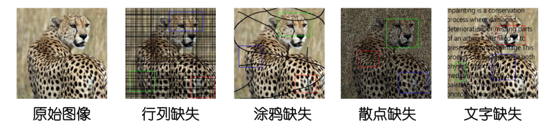

#### 均值滤波在填充中的应用

均值滤波由于会将椒盐点或丢失点的无意义值加入平均值，从而导致填充结果出现巨大误差，因而在滤波时，应当<span style="color: red;">**筛选邻域内有效的像素点**</span>进行平均值的计算，完成滤波操作。

同时，可以对滤波算法剪枝，<span style="color: red;">**仅计算无效点的滤波结果**</span>。这样就无需在滤波后恢复真实值了。

部分无效像素附近的有效像素偏少，或临近图像边界，导致平均值出现偏差，因而恢复效果**略不如中值滤波**。

#### 反复小窗口滤波

过大的滤波窗口容易使多个区域混淆，导致平均结果远远不符合预期。小滤波窗口可以确保填充区域边缘较为准确，但无法影响到内部填充区域。

利用<span style="color: red;">**反复滤波+恢复真实值**</span>的方法，自外向内一层一层对填充区域进行估计与更新，可以获得相对更加理想的效果。

#### 非局部匹配与图像填充

非局部匹配也是图像填充的重要方法，利用当前为止像素点的邻域内的有效值形成“不完整小块”，与搜索窗口内其他“不完整小块”进行比较，最终利用<span style="color: red;">**最接近小块，或加权平均**</span>的结果来确定填充结果，是流程化填充方法的主要思想。

对于比较粗的填充区域，往往需要规定合理的填充顺序，普遍这种顺序定义为<span style="color: red;">**从外向内**</span>的填充顺序。

---

## 第十二课：图像反卷积与其他恢复问题

### 图像反卷积问题

- 图像反卷积问题亦称之为图像去模糊问题。该问题恢复的图像往往是原图像和某个模糊核算子进行卷积所得到的模糊图像，有时可能附带一些噪声。
- 在不考虑噪声干扰的情况下，如果模糊核已知，不论采用哪一种边界条件（零延拓、复制边界条件、周期边界条件、对称边界条件等）， <span style="color: red;">**图像的卷积模糊操作本质上是一种线性变换**</span>。将清晰图像视作 $m\times n$ 维向量 $f$，模糊图像视作 $m\times n$ 维向量 $g$，则退化模型为 $Af = g$。
- 注意：矩阵 $A$ 是一个 $(m\times n)\times (m\times n)$ 的大型矩阵，并不是模糊核本身。当模糊核明显小于图像时， $A$ 为稀疏矩阵（思考为什么）。可以注意到 $A$​ 通常是可逆矩阵，但图像模糊效果伴随着整数量化的误差，从而为反卷积带来了一定的难度。

这是因为在这种情况下，模糊核仅影响图像中的局部区域，而不是整个图像。具体来说，每个像素的模糊只会影响它周围一个小范围的像素。因此，矩阵 $A$ 的非零元素只出现在与这些局部模糊相关的行和列中，其余大部分元素都为零，从而使得 $A$ 成为稀疏矩阵。

原图 $f(x,y)$ 为 $A\times B$ 大小，模糊核 $h(x,y)$ 为 $C\times D$ 大小。而后用零延拓将图像和模糊核函数扩展成 $M = A+C - 1$ 和 $N = B+D-1$ 个元素的周期函数，则


#### 矩阵 $A$ 的托普利茨矩阵表示形式

要理解图中的矩阵 $A$ 的托普利茨（Toeplitz）矩阵表示形式，我们可以从以下几个方面来分析：

##### 1. 托普利茨矩阵的定义
托普利茨矩阵是一种特殊形式的矩阵，其中每一条从左上到右下的对角线上的元素都是相同的。具体来说，如果矩阵 $T$ 是一个 $n \times n$ 的托普利茨矩阵，那么它满足如下条件：
$$ T_{i,j} = T_{i+1, j+1} $$
这意味着矩阵中的每个对角线上的元素都相等。

##### 2. 图中矩阵 $A$ 的结构
图中展示的矩阵 $A$ 是一个由多个子矩阵 $H_j$ 组成的大矩阵。每个子矩阵 $H_j$ 都是一个托普利茨矩阵。具体来说，矩阵 $A$ 可以表示为：
$$
A_{M \times M} = \begin{bmatrix}
H_0 & H_{M-1} & H_{M-2} & \cdots & H_1 \\
H_1 & H_0 & H_{M-1} & \cdots & H_2 \\
H_2 & H_1 & H_0 & \cdots & H_3 \\
\vdots & \vdots & \vdots & \ddots & \vdots \\
H_{M-1} & H_{M-2} & H_{M-3} & \cdots & H_0
\end{bmatrix}
$$
可以看出，矩阵 $A$ 中的每个元素本身又是一个托普利茨矩阵 $H_j$。

##### 3. 子矩阵 $H_j$ 的结构
每个子矩阵 $H_j$ 的具体结构如下：
$$
H_j = \begin{bmatrix}
h_e(j,0) & h_e(j,N-1) & h_e(j,N-2) & \cdots & h_e(j,1) \\
h_e(j,1) & h_e(j,0) & h_e(j,N-1) & \cdots & h_e(j,2) \\
\vdots & \vdots & \vdots & \ddots & \vdots \\
h_e(j,N-1) & h_e(j,N-2) & h_e(j,N-3) & \cdots & h_e(j,0)
\end{bmatrix}
$$
这里 $h_e(j,k)$ 是模糊核的元素，这些元素满足托普利茨矩阵的性质，即每个对角线上的元素都是相同的。

##### 4. 稀疏矩阵

由于模糊核通常比图像小很多，模糊核只会影响图像的局部区域，因此矩阵 $A$ 中大多数元素是零，这使得 $A$ 是一个稀疏矩阵。稀疏矩阵的性质使得在存储和计算时可以更加高效。

图中的矩阵 $A$ 是一个大型的块托普利茨矩阵，其中每个块 $H_j$ 本身也是一个托普利茨矩阵。由于模糊核的局部影响，矩阵 $A$ 中包含大量的零元素，使其成为稀疏矩阵。这种矩阵结构在处理大规模图像处理问题时具有重要的实际意义。观察可知𝑨转置仍然代表一种卷积操作，但卷积核相比原卷积核分别进行了一次上下翻转与左右翻转。傅里叶变换相当于取共轭。  

#### 该方法对于整数舍入的脆弱性

其取值会相比严格的数值卷积结果有小的误差，但仅仅这些误差就可以使恢复结果变得完全崩溃，主要原因就是**除法对于误差的脆弱性**，使得恢复图像的傅里叶变换存在明显误差。  

#### 使用反问题求解方法

反问题指的是从观测数据中推断出系统或过程的原始状态。具体来说，在图像处理中的反卷积问题中，我们试图从模糊图像中恢复出清晰图像。这个问题可以表示为：
$$ Af = g $$
其中，$A$ 表示模糊矩阵，$f$ 表示原始图像的向量形式，$g$ 表示模糊图像的向量形式。反问题的核心任务是从已知的 $g$ 和 $A$ 中求解出未知的 $f$。

##### 反问题方法的优势

1. **通用性**：反问题方法适用于各种边界条件，无论是零边界、复制边界还是周期性边界条件。这使得该方法在不同的应用场景下都能够得到良好的效果。

2. **鲁棒性**：反问题方法对整数误差具有鲁棒性。即使在处理过程中存在一些小的误差，反问题方法也能有效地恢复出原始图像。

3. **数值稳定性**：反问题方法可以通过引入正则化技术（如广义最小残差法）来提高数值计算的稳定性，避免因噪声或误差导致的解不稳定现象。


### 逆滤波复原问题

**非约束复原**，根据对退化系统 $H$ 和噪声 $n$ 的了解，已知退化图像 $g$ 的情况下，在一定的最小误差准则下得到原始图像 $f$ 的估计。

>  逆滤波是**最早使用**的一种**无约束复原**方法，本质上就是前述傅里叶变换的除法版本成功地应用于航天器传来的退化图像。

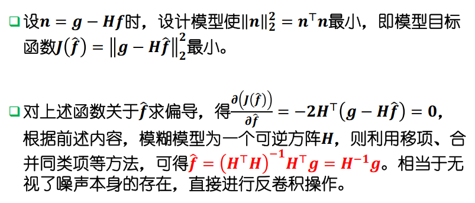

**无视了噪声本身的存在**

#### 约束复原方法

约束复原除了对降质系统的PSF有所了解外，还需要对原始图像和外加噪声的特性有先验知识。

根据不同领域的要求，有时需要对 $f$ 和 $n$ 作一些特殊的规定，使处理得到的图像满足某些条件。

**约束最小二乘法复原问题** 令 $Q$ 为 $f$ 的线性算子，要设法寻找一个最优估计 $\hat{f}$，使其形式为 $\|Q\hat{f}\|^2$的服从约束条件 $\|g - H\hat{f}\|^2 = \|n\|^2$ 的函数最小化问题，而 $\|Q\hat{f}\|^2$ 被称为<span style="color: red;">**正则项**</span>，$Q$ 称为线性正则变换，用以刻画恢复图像的某些内在性质，而另一个约束项 $\alpha\left(\|g - H\hat{f}\|^2 - \|n\|^2 \right)$ 称为<span style="color: red;">**保真项**</span>，用以刻画图像噪声的信息。

而目标函数为 $J(\hat{f}) = \|Q\hat{f}\|^2 + \alpha\left(\|g - H\hat{f}\|^2 - \|n\|^2 \right)$ 最小，这里的 $\alpha$ 为保真项的惩罚强度，对上述函数关于 $\hat{f}$ 求偏导并令其等于 $0$，可以得到	
$$
	\hat{f} = (H^T H + \gamma Q^T Q)^{-1} H^T g
$$
其中 $\gamma = \alpha^{-1}$，可以成为正则项惩罚强度。

#### 维纳滤波

维纳滤波（Wiener Filtering）是一种经典的线性滤波方法，用于在信号处理和图像处理领域中去除噪声和恢复原始信号。其目标是通过最小化信号和噪声之间的均方误差来实现最佳的信号恢复。

从图片中的公式开始解释：

1. 首先定义了两个矩阵：
   - $ R_f = E\{ff^T\} $ 代表信号 $ f $ 的自相关矩阵。
   - $ R_n = E\{nn^T\} $ 代表噪声 $ n $ 的自相关矩阵。

2. 定义 $ Q^T Q $ 矩阵为 $ R^{-1}R_n $，其中 $ R $ 是信号和噪声无关的假设下的相关矩阵。<span style="color: red;">**信噪不相关**</span>

3. 根据这个定义，维纳滤波的解形式为：
   $$
   \hat{f} = (H^T H + \gamma R_f^{-1} R_n)^{-1} H^T g
   $$
   其中：
   
   - $ H $ 是系统矩阵（或卷积矩阵）。
   - $ \gamma $ 是常数，用于调整滤波器的强度。
   - $ g $ 是观测到的信号。
   
4. 假设 $ M = N $， $ S_f $ 和 $ S_n $ 分别为图像和噪声的功率谱，得到：
   $$
   \hat{F}(u,v) = \left[ \frac{H^*(u,v)}{|H(u,v)|^2 + \gamma \left[ \frac{S_n(u,v)}{S_f(u,v)} \right]} \right] G(u,v)
   $$
   这个公式描述了维纳滤波在频域中的实现形式，其中：
   
   - $ H(u,v) $ 是频域中的传递函数。
   - $ H^*(u,v) $ 是传递函数的共轭。
   - $ G(u,v) $ 是观测到的信号的频谱。

维纳滤波的基本思想是在频域中调整信号的频谱，以最小化信号恢复中的误差。通过使用信号和噪声的统计特性（自相关函数或功率谱），维纳滤波能够有效地去除噪声，同时保留尽可能多的原始信号信息。

- $\gamma = 1$ 时，系统函数 $H_w(u,v)$ 是维纳滤波器的传递函数，常根据噪声强度设置 

$$
\hat{F} (u,v) = \left[\frac{H^*(u,v)}{|H(u,v)|^2 + K} \right] G(u,v)
$$

- 如果 $\gamma = 0$，即系统变成单纯的去卷积滤波器，传递函数即为 $H^{-1}$
- 若 $\gamma$ 为可调整的其他参数，此时为参数化维纳滤波器  

#### 平滑度约束最小平方滤波

设置不同的 $Q$ 来达到反卷积效果，例如拉普拉斯算子的离散卷积核的高通滤波来进行近似等。

#### 图像盲反卷积

即既不知道清晰图像 $f$，也不知道退化矩阵 $A$​。

现在的相机“防抖”技术一般是通过<span style="color: red;">**传感器**</span>大致获取模糊核的值，或通过连续拍摄<span style="color: red;">**多帧照片**</span>（短视频）并结合三维重构的方法来避免模糊。

目前主流的单图盲反卷积方法有两种，一种是结合一些对模糊核的正则约束，<span style="color: red;">**同时求解模糊核与清晰图像**</span>。另一种则是<span style="color: red;">**先对模糊核进行大致估计**</span>，在用普通反卷积算法恢复

### 图像去雾

**暗通道算法**：
$$
	I(x) = J(x) t(x) + A(1 - t(x))
$$
其中 $I(x)$ 为雾化图，$J(x)$ 为真实图，$t(x)$ 为透射率，$A$​ 为大气光强度。先估计 $A$ 的值，而后对 $J(x)$ 加上必要的正则约束即可解出真实图 $J(x)$。

> 即物体反射的光由于雾的效果，只能反射出 t(x) 的光强，而后雾也有自身的反射，在CMOS中收到的即为两部分叠加之和。

### 归纳总结

| 方法                   | 基本情况                                                     | 优点                                                   | 缺点                                                         |
| ---------------------- | ------------------------------------------------------------ | ------------------------------------------------------ | ------------------------------------------------------------ |
| 逆滤波（无约束）       | 使用已知退化系统 $ H $ 和噪声 $ n $，通过傅里叶变换求解原始图像 $ f $ 的估计。 | 对退化图像有较好的复原效果。                           | 对噪声非常敏感，**恢复效果容易受到噪声影响**。               |
| 约束最小二乘法         | 在对降质系统和噪声有先验知识的基础上，设法找到最优估计。     | 可以在噪声环境中有效恢复图像，对噪声有一定的鲁棒性。   | 需要对噪声和原始图像的特性有较好的先验知识，计算复杂度较高。 |
| 维纳滤波               | 基于信号和噪声的统计特性，最小化均方误差进行图像恢复。       | 对信噪比变化有较好的适应性，能有效去除噪声并保留信号。 | 需要知道信号和噪声的功率谱，计算复杂度较高。                 |
| 平滑度约束最小平方滤波 | 使用拉普拉斯算子作为正则项，对图像进行高通滤波，达到去模糊效果。 | 可以在高噪声环境中有效恢复图像，减少伪影和噪声影响。   | 需要合理选择正则化参数，计算复杂度较高。                     |
| 盲反卷积               | 在未知模糊核和原始图像的情况下，通过估计模糊核和清晰图像进行恢复。 | 不需要预先知道模糊核，可以处理更复杂的模糊情况。       | 对初始模糊核估计敏感，计算复杂度高，恢复效果不如有先验知识的情况。 |
| 参数化维纳滤波         | 通过调整参数 $ \gamma $ 控制滤波器的强度，实现不同程度的去模糊效果。 | 可以灵活调整滤波器参数，适应不同的噪声环境和图像情况。 | 参数调整较为复杂，恢复效果依赖于参数选择。                   |

这些反卷积方法各有优缺点，具体使用时需要根据实际情况选择合适的方法。如果需要详细介绍或代码实现，可以参考课程PPT中的具体章节。

---

## 第十三课：正则化模型与优化算法（上）

### 最小二乘拟合

最小二乘函数 $\|A\vec{x} - b\|_2$ 最小当且仅当 
$$
\|A\vec{x} - \vec{b}\|_2^2 = \vec{x}^T A^T A \vec{x} - \vec{x}^T A^T \vec{b} - \vec{b}^TA\vec{x} + \vec{b}^T\vec{b}
$$
最小，而后对 $\vec{x}$ 求导，而后令偏导数均为0即可得到
$$
	2A^T A\vec{x} - A^T \vec{b} - A^T \vec{b} = 0
$$
即
$$
	A^T A \vec{x} = A^T \vec{b}
$$
而当 $R(A) = n$ 时，最小二乘解唯一，并且有等价表达式 $\vec{x} = (A^T A)^{-1} A^T\vec{b}$。

#### 梯度下降法

参考运筹学中的方法，计算 $\nabla f$ 而后代入 $\vec{x}^k$ 即可，即 $\vec{x}^{k+1} = \vec{x}^k - \delta \cdot \nabla f(\vec{x}^k)$ 即可。而后对 $\delta$ 求偏导数即可。

#### 梯度下降法解决图像反卷积问题

由于计算 $A^{-1}$ 往往比较困难，但是 $A^T$ 却可以通过翻转模糊核的情况来进行卷积模拟，因此可以用梯度下降法高效完成反卷积的模拟。

#### 共轭梯度法解决图像反卷积问题

直接求解反问题 $(A^TA)\vec{x} = A^T \vec{b}$，而 $A^TA$ 正定矩阵符合要求。 

#### 岭回归与正则约束

对拟合系数进行必要的约束，使其绝对值不会太大，避免系数膨胀或对部分错误/离群信息过拟合。也可以防止最小二乘解不唯一时，任意解膨胀的情况 。
$$
\color{red} \min\limits_{a_1,a_2,\cdots, a_{n+1}} \| y - (a_1 x^n + \cdots + a_n x + a_{n+1}) \|_2^2 + \lambda \|a\|_2^2
$$
其中 $a = [a_1\ a_2 \ \cdots\ a_{n+1}]$ 表示拟合系数，而也可以等价描述为	
$$
\min\limits_{\vec{x}} \frac{1}{2} \|A\vec{x} - \vec{b}\|_2^2 + \frac{\lambda}{2} \| \vec{x} \|_2^2
$$
  而第一项称为<span style="color: red;">**保真项**</span>，使得误差尽可能小，第二项称为<span style="color: red;">**正则项**</span>，控制 $\vec{x}$ 的向量规模。

由于目标函数可微，也可以类似于前面的最小二乘问题，用梯度下降法求解，也可以令梯度等于零得到最优解。

#### 图像梯度的引入与 Tikhonov 正则模型

对于大多数的自然图像而言，其图像的颜色或灰度值大都是不等于0甚至不接近于0的。因此，前述的正则模型很可能仅会将图像暗度降低，对于图像的噪声控制或其他方面帮助往往并不大。但是，对于大部分分片光滑的图像而言，他们的图像差分算子得到的结果，却可以满足区域内像素的差分结果普遍接近于0。  

Tikhonov 模型也是一种 L2 正则化模型

> 正则化模型即考虑`惩罚项`的范数 $\|\cdot\|_{?}$
>
> **L0正则化**：直接限制非零参数个数，难以优化。
>
> **L1正则化**：通过绝对值惩罚项实现特征选择，产生稀疏模型。
>
> **L2正则化**：通过平方和惩罚项缩小参数值，防止过拟合。
>
> **Elastic Net正则化**：结合L1和L2的优点，兼顾稀疏性和参数缩减。

其最大的区别是正则的向量不是原始的图像向量，而是计算梯度之后的向量，梯度的计算可以使用简单的向前或中心差分算子，亦可以使用包括Sobel算子在内的偏导数计算算子：  	

$$
\min\limits_{\vec{x}} \frac{1}{2} \| A\vec{x} - \vec{b}\|_2^2 + \frac{\lambda}{2} \|\nabla \vec{x}\|_2^2
$$
Tikhonov模型的求解可以与岭回归模型一样，通过显示表达式
$$
\vec{x} = (A^T A + \lambda \nabla^T \nabla)^{-1} (A^T\vec{b})
$$
直接解出，该模型同样可以使用共轭梯度法解出。

该模型求解的时候， 正则项不再以将图像灰度接近于 0 为目标，而是以<span style="color: red;">**“弱化图像噪声、边界及纹理信息”**</span>为主要目的。 $\lambda$ 的增大意味着更强力的去噪，也更容易对图像信息造成破坏，直到将图像磨平成几乎等于常数的灰图。

### 正则化模型总结

| 正则化类型              | 优点                                                         | 缺点                                 | 适用场景           |
| ----------------------- | ------------------------------------------------------------ | ------------------------------------ | ------------------ |
| **L2 正则化（岭回归）** | 防止过拟合，解决共线性问题                                   | 无法产生稀疏模型，所有特征都参与计算 | 图像去噪、图像恢复 |
| **Tikhonov 正则化**     | 考虑图像梯度，适用于图像去噪和恢复。<span style="color: red;">**“弱化图像噪声、边界及纹理信息”**</span> | 计算复杂度较高，参数选择较为复杂     | 图像处理、图像去噪 |

---

## 第十四课：正则化模型与优化算法（下）

| 正则化类型                 | 优点                                             | 缺点                                                     | 适用场景           |
| -------------------------- | ------------------------------------------------ | -------------------------------------------------------- | ------------------ |
| **L0 正则化**              | 产生稀疏模型，可以将某些特征权重置为0            | 在**高维空间中优化困难**，非凸函数，收敛性差。过于理想化 | 稀疏建模，特征选择 |
| **L1 正则化（Lasso回归）** | 产生稀疏模型，有助于特征选择，适用于高维数据     | 求解**复杂度较高**，参数选择复杂                         | 图像去噪、稀疏建模 |
| **L2 正则化（岭回归）**    | 防止过拟合，适用于处理**共线性**问题，算法稳定   | 无法产生稀疏模型，所有特征都参与计算                     | 图像去噪、图像恢复 |
| **全变分正则化（TV模型）** | 适用于去噪和图像恢复，保留边缘信息，减少噪声     | 边缘趋于分片常数函数，细节可能丢失                       | 图像去噪、图像恢复 |
| **Tikhonov 正则化**        | 适用于图像梯度的平滑处理，抑制噪声和保持图像结构 | 计算复杂度较高，参数选择复杂                             | 图像处理、图像去噪 |

$l_0$ 正则模型一系列优化算法都面临不收敛的问题，<span style="color: red;">**直到现在如何设计 $l_0$ 模型并顺利求出其全部最优解或优质局部最优解都是前沿的计算数学问题**</span>。$l_0$ 是非凸的，这是由于若 $\vec{x}_0 = \binom{1}{0}$，$\vec{x}_1 = \binom{0}{1}$，则这二者的零范数均为 $0$，但 $\frac{\vec{x}_0 + \vec{x}_1}{2} = \frac{1}{2} \binom{1}{1}$，其范数为 $1$。

### 软阈值算法（L1)

对于 $l_1$ 模型而言，
$$
	\min\limits_x \frac{1}{2} (x-y)^2 + \lambda |x|
$$
这个模型的正则化的解为
$$
x = \left\lbrace\begin{array}{ll}
    	\text{sign}(y)(|y| - \lambda), & |y|\geqslant \lambda\\
    	0, & y < \lambda
    \end{array}\right.
$$
这种解所对应的 $x$ 关于 $y$ 的表达式称为**“软阈值算法”**，其特点为大绝对值向原点靠近，小绝对值直接化为 $0$。  


### Lasso 与 L1 正则化模型

对拟合系数具有稀疏正则的模型  
$$
	\color{red}\min\limits_{a_1,a_2,\cdots,a_{n+1}} \frac{1}{2} \| y - (a_1x^n + \cdots + a_n x + a_{n-1}) \|_2^2 + \lambda \|a\|_1
$$
该模型1化为如下的最优化模型
$$
\min\limits_{\vec{x}} \frac{1}{2} \|A\vec{x} - \vec{b}\|_2^2 + \lambda\|\vec{x}\|_1
$$
第一项称为保真项，第二项称为正则项，它用来对模型参数进行惩罚，以防止过拟合。

这里的目标函数<span style="color: red;">**并不可微分**</span>，而第一项为非线性项，故而也无法通过广义的线性规划以及单纯形法求解。但是可以用<span style="color: red;">**近端梯度下降算法**</span>求解。


| 近端梯度下降算法 | 一阶收敛速度 |
| ---------------- | ------------ |
| 加速近端梯度算法 | 二阶收敛速度 |

### L1正则——全变分模型

全变分模型也成为TV（Total Variation）模型，最初是基于泛函分析和偏微分方程的形式在连续空间进行分析与建模的。其离散形式可以定义如下  
$$
\min\limits_{\vec{x}} \frac{1}{2} \|A\vec{x} - \vec{b}\|_2^2 + \lambda\|\nabla \vec{x}\|_1
$$


| 算法名称                       | 主要思想                                                     | 优点                                                       | 缺点                                                         | 适用场景                 |
| ------------------------------ | ------------------------------------------------------------ | ---------------------------------------------------------- | ------------------------------------------------------------ | ------------------------ |
| **近端梯度下降算法**           | 将问题分解为保真项和正则项，通过梯度下降法和近端运算交替进行优化。<span style="color: red;">**一阶收敛速度**</span> | 适合处理高维稀疏问题，收敛速度较快。                       | 参数选择复杂，可能需要大量迭代。                             | Lasso问题，稀疏建模      |
| **加速近端梯度下降算法**       | 使用Nesterov加速，提高收敛速度。<span style="color: red;">**二阶收敛速度**</span> | 提高了收敛速度，适合处理大规模优化问题。                   | 算法复杂度较高，参数选择敏感。                               | 大规模图像处理、机器学习 |
| **ADMM算法**                   | 引入辅助变量，将问题分解为易解的子问题，通过交替优化求解。   | 适用于各种带有线性变换的L1正则化问题，具有较好的收敛效果。 | 每次迭代需要求解一次反问题，速度较慢。<span style="color: red;">**明显慢于近端梯度算法**</span> | L1正则化问题，图像处理   |
| **共轭梯度法**                 | 通过最小化二次型来解决线性方程组。                           | 收敛速度快，适合大规模稀疏系统。                           | 需要较多的存储和计算资源。                                   | 大规模线性方程组         |
| **软阈值算法**                 | 用于L1正则化模型的解，通过将小于阈值的系数置为0来实现稀疏解。 | 简单有效，适合稀疏建模。                                   | 对于复杂问题可能效果不佳。                                   | 稀疏建模                 |
| **共轭梯度法（用于ADMM算法）** | 在ADMM算法中，作为内层迭代求解反问题的一部分。               | 有效提高ADMM算法的收敛速度。                               | 需要在每次迭代中求解反问题，计算量大。                       | ADMM算法中的子问题求解   |

## 第十五周：图像分割（上）

### 定义

图像分割的最简单形式通常是指定图像像素集合的一个连通子集，指出图像中感兴趣的区域（ROI）。

后续的图像分割或语义分割可以将图像提取或分离成两个或多个连通区域，用以对每一个区域分别进行识别、分析或处理。

图像分割的分类方式比较丰富，但大体来说主要是基于<span style="color: red;">**不连续性的边界的分割**</span>，和基于<span style="color: red;">**区域相似性**</span>的分割。边界分割包括边界检测与边界跟踪方法，基于区域相似性的分割方法包括聚类方法以及区域生长或水平集算法。

分割结果中同一个子区域内的像素应当是<span style="color: red;">**连通**</span>的，同一个子区域内的任两个像素在该子区域内互相连通。

- 四邻域
  - 边界点：该点是对象的一部分（即灰色），但至少有一个相邻点是背景（即白色）。
  - 内点与孤点：显然


- 八邻域

### 阈值分割

#### 灰度阈值分割方法

若图像中目标和背景具有不同的灰度集合，且两个灰度集合可用一个**灰度级阈值** $T$ 进行分割。这样就可以用阈值分割灰度级的方法在图像中分割出目标区域与背景区域。

在图像的灰度级范围内 $[0,L]$ 内选择一个合适的灰度阈值，依次阈值 $T$ 分割，大于的记 $0$，剩下的记 $1$。

#### 图像全局阈值分割

全局阈值是最简单的图像分割方法。根据不同的目标，选用最佳的阈值。

1. 实验法：需要知道图像的某些特征（特别适用于相似的医学图像切片、卫星成像图像等）
2. 直方图法：适用于目标和背景的灰度差较大，直方图有明显谷底的情况 
3. 最小误差估计法：假设背景与 ROI 的概率密度函数分别为 $p_1(z)$ 与 $p_2(z)$，若假设阈值为 $t$，背景部分像素比例为 $0 < \theta < 1$，即可算出总错误概率为  

$$
	E(t) = \theta E_1(t) + (1-\theta) E_2(t) = \theta\int_{-\infty}^t p_1(z)dz + (1-\theta) \int_t^{\infty}p_2(z)dz
$$

对 $t$ 求导数即得
$$
	E^{\prime}(t) = \theta p_1(z) - (1-\theta)p_2(t) = 0
$$
如果为正态分布，即 $p_1(z) = \frac{1}{\sqrt{2\pi}\sigma_1} \exp{-\frac{(z - \mu_1)^2}{2\sigma_1^2}}$，$p_2(z) = \frac{1}{\sqrt{2\pi}\sigma_2} \exp{-\frac{(z - \mu_2)^2}{2\sigma_2^2}}$，则代入得
$$
\frac{\theta}{\sigma_1} \exp{-\frac{(z - \mu_1)^2}{2\sigma_1^2}} = \frac{1 - \theta}{\sigma_2} \exp{-\frac{(z - \mu_2)^2}{2\sigma_2^2}}
$$
从而取对数
$$
\ln\left(\frac{1-\theta}{\theta}\frac{\sigma_1}{\sigma_2}\right) = \frac{(t - \mu_2)^2}{2\sigma_2^2} - \frac{(t - \mu_1)^2}{2\sigma_1^2}
$$

4. 最大类间方差法：该方法基于对图像的灰度直方图统计进行阈值的遍历和估计。设图像灰度范围为 $[0,L-1]$，并设总像素数为 $N$，每一灰度像素数为 $n_i$，对应概率即为 $p_i = \frac{n_i}{N}$。 设阈值设为 $t$，则第一类区域 $C_1$ 对应灰度范围 $[0, t]$，总概率 $\sum\limits_{i=0}^t p_i = \theta$；第二类区域 $C_2$ 对应灰度范围 $[t + 1, L - 1]$ ，总概率 $\sum\limits_{i=t+1}^{L-1} p_i = 1 - \theta$​。  *这里 ppt 打错了*

​	而后可以计算总均值 $\mu = \sum\limits_{i=0}^{L-1} ip_i$，第一类区域均值与第二类区域均值分别为
$$
\begin{align}
	\mu_1 &= \frac{\sum\limits_{i=0}^t ip_i}{\theta} \\
	\mu_2 &= \frac{\sum\limits_{i=t+1}^{L-1} ip_i}{1-\theta}
\end{align}
$$
​	从而我们可以定义类间方差：
$$
	\sigma^2 = \theta (\mu - \mu_1)^2 + (1-\theta)(\mu - \mu_2)^2 = \theta(1-\theta)(\mu_2 - \mu_1)^2
$$
​	因为此式的 $\theta,\mu_1,\mu_2$ 均与 $t$ 有关，且无法代入并完成化简。通常需要对所有可能的 $t$ 进行遍历，寻找最大化 $\sigma_2$ 的 $t$ 作为分割阈值，其目的为尽量让灰度差距体现在不同区域之间。  

#### 图像自适应/局部阈值分割

当**照明不均匀、 有突发噪声或者背景灰度变化比较大**的时候， 可以对图像进行**分块处理**，对每一块分别选定一个阈值进行分割， 这种与**坐标相关的阈值**称为自适应阈值的方法。

这类算法的时间复杂度和空间复杂度比较大，但是**抗噪声的能力比较强**。

任何一种分割方法都有其局限性。实际的算法只能**根据实际情况选择方法和阈值**。

#### 边缘检测

基于**灰度不连续性进行**的分割方法。

用差分、梯度、拉普拉斯算子及各种高通滤波处理方法对图像边缘进行增强，只要再进行一次门限化的处理，便可以将边缘增强的方法用于边缘检测。


[一阶差分算子](####差分算子)

##### 二阶差分算子

拉普拉斯算子

高斯-拉普拉斯算子（LoG算子）：先用高斯核做均值滤波，再用拉普拉斯算子进行边缘检测。

#### 坎尼算子与边缘检测

坎尼算子是基于高斯滤波器定义的边缘检测工具，第一步同样是先进行<span style="color: red;">**高斯滤波**</span>进行模糊化操作。而后使用高斯微分卷积核进行<span style="color: red;">**偏导数计算**</span>，其中
$$
\frac{\partial G}{\partial x} = kx\exp{-\frac{x^2}{2\sigma^2}} \exp{-\frac{y^2}{2\sigma^2}},\quad \frac{\partial G}{\partial y} = ky\exp{-\frac{x^2}{2\sigma^2}} \exp{-\frac{y^2}{2\sigma^2}}
$$
两卷积核均可以类似高斯滤波进行离散化，然后在合适大小的窗口模板进行卷积，获得两个数值偏导数的值。

不过，判断是否边缘的条件，不是直接看梯度的模长是否够大，而是观察**该点梯度模长是否大于梯度方向相邻两点的梯度模长**（避免边缘过粗）；**且梯度方向相邻亮点方向差小于45度**（避免纹理或细节错分）；**且以该像素为中心的3X3邻域最大模长需不小于某阈值**（避免光滑区域误判）。

#### 方向算子与边缘检测


- 模板中权值最大的方向就是该模板的主检测方向。权值为正的区域表示边缘方向的正侧，权值为负的区域表示边缘方向的负侧。例如第一幅图的方向为水平向右，而第二幅图为右上45度。

#### 边缘跟踪

边缘检测方法仅得到处在**边缘上的像素点**。噪声和不均匀的照明而产生的边缘间断的影响，使得经过边缘检测后得到的边缘像素点很少能完整地描绘实际的一条边缘。可以在使用边缘检测算法后，紧接着使用**连接方法**将边缘像素组合成有意义的边缘。

一种利用局部信息连接边缘点的方法为**光栅扫描跟踪法**。

##### 光栅扫描跟踪法大致步骤：

1. 设置阈值将边缘检测结果较大的边缘强度(7)进行筛选。

2. 将大强度点的邻域点进行跟踪检测，用相对较低的强度阈值(4)接受更多的点成为边缘点。

3. 按照从上到下、从左到右的顺序，进行遍历检测，直至各曲线完成

### 曲线演化与图像分割  

活动轮廓模型是利用初始曲线，在加入合适限制的情况下，演化曲线并使得曲线最终和图像边界趋于重合的模型。最经典的活动轮廓模型称为**Snake模型**。

### 总结

| 图像分割方法          | 描述                                                         |
| --------------------- | ------------------------------------------------------------ |
| 边界分割              | 基于不连续性的边界分割，包括边缘检测与边缘跟踪方法。         |
| 区域分割              | 基于区域相似性的分割方法，包括聚类方法、区域生长、水平集算法等。 |
| 阈值分割              | 使用灰度阈值将图像分割为目标区域与背景区域，包括全局阈值和自适应阈值方法。 |
| 边缘检测              | 利用灰度不连续性进行的分割方法，使用差分、梯度、拉普拉斯算子及高通滤波等方法增强边缘。 |
| 边缘跟踪              | 将边缘检测后的像素点组合成有意义的边缘，常用方法包括光栅扫描跟踪法。 |
| 曲线演化              | 利用初始曲线在加入限制条件下演化曲线，使曲线与图像边界重合，经典模型包括Snake模型。 |
| 4邻域与8邻域          | 定义像素的邻接关系，4邻域包括两个水平和两个垂直像素，8邻域包括像素周围的8个点。 |
| 最小误差估计法        | 根据背景与ROI的概率密度函数，计算使总错误概率最小的阈值。    |
| 最大类间方差法        | 基于图像灰度直方图统计，通过遍历估计最优阈值，使类间方差最大。 |
| 高斯-拉普拉斯边缘检测 | 先用高斯核做均值滤波，再用拉普拉斯算子进行边缘检测。         |
| 坎尼算子边缘检测      | 先进行高斯滤波，再用高斯微分卷积核计算偏导数，通过梯度方向相邻两点的比较来判断边缘。 |
| 方向算子边缘检测      | 利用一组模板对图像同一像素求卷积，选取最大值作为边缘强度和方向，常用8方向Kirsch模板。 |

## 第十六课：图像分割（下）（几乎不考）

### 霍夫变换

传统霍夫变换是基于点-线的对偶性，统计并记录图像平面上所有斜率和所有位置的直线上边缘点的数量。并将边缘点较多的直线进行延长或标注。该方法曾用于车牌照定位等应用场景。  

假设我们思考的斜率范围为 $[p_{min},p_{max}]$，对每一个边缘点 $(x,y)$， 取 $p^∗ \in [p_{min}, p_{max}]$，代入 $y = px +q$，计算出对应的截距 $q^*$，而后在 $A(p^∗, q^∗)$ 处增加一次计数。最终，根据最大或较大的 $A(p,q)$ 的值，确定一条或一组直线。

#### 极坐标形式——精度更高

利用点法式方程 $\rho = x\cos\theta + y\sin\theta$​，与传统霍夫变换不同，每一个边缘点 $(x,y)$ 在参数空间的计数轨迹不再是一条直线，而是正弦曲线。

在这种极坐标的直线表示意义之下，每一个边缘点会在 $\theta\in[-\pi/2,\pi/2]$ 的范围内确定一组 $(\rho^∗, \theta^∗)$ ，并加以计数。由于极坐标下的正弦曲线在参数空间中表现为连续的轨迹，多个边缘点的轨迹会在正确的参数处产生明显的峰值，这样可以提高直线检测的精度和稳定性。（？）

### 区域生长法

将具有相似性质的像素集合起来构成区域。先对每个需要分割的区域找一个种子像素作为生长的起点，然后将种子像素周围邻域中与种子像素具有相同或相似性质的像素合并到这一区域中。

将这些新像素当做新的种子像素继续进行上面的过程，直到再没有满足条件的像素可被包括进来。这样一个区域就长成了。该方法对于有多个灰度接近但并不连通的区域分割效果更佳显著。

在实际应用区域生长法时需要解决三个问题：

1. 选择一组能正确代表所需区域的种子像素；种子像素的选取常可借助具体问题的特点进行。
2. 确定在生长过程中将相邻像素包括进来的准则；生长准则的选取不仅依赖于具体问题本身，也和所用图像数据的种类有关。
3. 制定让生长过程停止的条件或规则。一般生长过程在进行到再没有满足生长准则需要的像素时停止。


这里的 $T$ 应该就是阈值，如果与 $1$ 相差在 $T$ 以内的邻域，则都会被视为 $1$。

### 曲线演化问题

设 $C(s,t)$ 为 $t$ 时刻的光滑封闭曲线，其中 $s$ 为弧长参数，设 $\vec{T}$ 和 $\vec{N}$ 分别为曲线的单位切向量和单位法向量，则曲线的运动情况	
$$
\frac{\partial C}{\partial t} = \alpha(s,t)\vec{T} + \beta(s,t)\vec{N}
$$
其中 $\alpha$ 和 $\beta$ 分别为曲线的切向与法向速率。而朴素的曲线演化过程假设切向速率为 $0$，只考虑法向速率，即运动方程可简化为
$$
\frac{\partial C}{\partial t} = F\vec{N}
$$

### 水平集

水平集方法引入比曲线高一维的水平集函数，并用水平集函数的等值线表示曲线，用水平集函数的演化代替曲线演化。即利用 $\phi(x,y) = y - f(x)$ 将其考虑在高一个维度的空间内，将曲线视为零水平集，即 $C(t) = \{(x,y)\mid \phi(x,y,t) = 0 \}$
$$
\frac{\partial \phi(x(t),y(t),t)}{\partial t} = \frac{\partial \phi}{\partial x}\cdot \frac{\partial x}{\partial t} + \cdots + \frac{\partial \phi}{\partial t} = \nabla \phi\cdot \frac{\partial C}{\partial t} + \frac{\partial \phi}{\partial t}
$$
由于在 $C(t)$ 上函数恒为0，故而其偏导数也为零，即
$$
	\nabla \phi\cdot \frac{\partial C}{\partial t} + \frac{\partial \phi}{\partial t} = 0
$$
根据曲线演化理论，$\phi$ 在曲线 $C$ 的切线方向变化量为 $0$，所以
$$
\langle \nabla \phi, \frac{\partial C}{\partial s}\rangle = 0
$$
因此 $\nabla\phi$ 与切线垂直，而单位法向量可以表示为 $\vec{N} =- \frac{\nabla\phi}{|\nabla\phi|}$，从而
$$
\frac{\partial \phi}{\partial t} = -\nabla\phi\cdot \frac{\partial C}{\partial t} = -\nabla\phi\cdot F \cdot -\frac{\nabla \phi}{|\nabla \phi|} = F\cdot |\nabla \phi|
$$
即这里二次方即可变成模的平方。

**水平集函数的初始化**： 通常将水平集函数初始化为符号距离函数（SDF）。SDF满足性质 $|\nabla\phi| = 1$，可以方便地计算曲线的法向量和曲率，并且使得水平集函数在各个方向上的变化不会过于平坦或陡峭。此外，SDF还具有光滑性和唯一性，便于水平集函数的计算和求导。给定初始曲线 $C_0$， 用 $d$ 表示 $(x, y)$ 到 $C_0$ 的欧氏距离，初始化水平集函数如下：


#### 水平集分割模型

最早的水平集图像分割模型为 Mumford-Shah 模型的基本思想是将图像分割成若干个区域，每个区域内的灰度值是相同的，而不同区域之间的灰度值是不同的。模型将分割结果表示为分段光滑的函数，并加上正则化项，用于保证分割结果的平滑性和对噪声的鲁棒性。  

给定图像 $I:\Omega\to\mathbb{R}$，设分割结果为 $u$，演化曲线为 $C$，将区域 $\Omega$ 分为不同的子区域 $\{\Omega_1,\Omega_2,\cdots,\Omega_n\}$，且 $u$ 在每个子区域都是光滑的，模型的能量泛函为
$$
E^{MS}(u,C) = \mu\cdot \text{Length}(C) + \lambda\iint_{\Omega} |u-I(x)|^2 dx + \nu \iint_{\Omega\backslash C} \|\nabla u\|^2 dx
$$
三项分别为曲线长度项、数据保真项、光滑正则项。通过最小化 $EMS$ 控制曲线的演化，$\text{Length}(C)$ 是曲线 $C$ 的长度，$\mu, \lambda, \nu$ 为非负常数。  

Chan 和 Vese 对 Mumford-Shah 模型进行了简化和改进，将分割结果 $u$ 简化为分段常数函数， 是一种基于全局能量泛函的分割方法。基于假设：**图像可以被分为前景和背景两个区域， 前景和背景各自有近似常数的灰度值， 且它们之间的边界可以用一条闭合曲线表示。**模型的目标是寻找这个闭合曲线，同时对前景和背景区域进行分割。

### 数据聚类

多个数据点如果形成明显的”成簇“聚集，即可使用聚类方法对数据进行分类与识别。该理念可以用于<span style="color: red;">**无监督学习和半监督学习**</span>的初步分类，也可以用于<span style="color: red;">**图像分割**</span>。  

### K-Means 聚类

**给定数据集并指定聚类数目 $k$，优化目标函数 ** 
$$
J = \sum\limits_{i=1}^k \sum\limits_{j=1}^{N_i} \|x_{ij} - C_i\|^2
$$
**其中，$x_{ij}$ 为第 $i$ 类第 $j$ 个样本；$N_i$ 为第 $i$ 类的样本个数；$C_i$ 为第 $i$ 类的聚类中心。**

K-means算法模型的主要含义是希望每一个样本距离自己的分类中心尽可能的接近，**其聚类集合必为凸集**。

#### K-Means 聚类

1. **随机选择 $k$ 个数据集中的点作为初始聚类中心；**
2. **对于数据集中的每个数据，计算它们与聚类中心的欧式距离，若数据离第 $i$ 个聚类中心最近，就将其划分为第 $i$ 类；**
3. **根据步骤 2 的分类结果，计算每一类的样本平均值，计算公式如下**

$$
C_i = \frac{1}{N_i} \sum\limits_{j=1}^{N_i} x_{ij}
$$

​	**将 $C_1, C_2, \cdots, C_k$ 设为新的聚类中心；**  

4. **重复步骤 2,3，直至聚类中心不再变化。**

#### K-Means ++ 聚类

**K-means++算法是K-means算法的改进算法，优化了初始聚类中心的选择方式，解决了K-means算法对初始聚类中心敏感的问题。给定数据集并指定聚类数目 $k$，仍优化目标函数**
$$
J = \sum\limits_{i=1}^k \sum\limits_{j=1}^{N_i} \|x_{ij} - C_i\|^2
$$
**其中，$x_{ij}$ 为第 $i$ 类第 $j$ 个样本；$N_i$ 为第 $i$ 类的样本个数；$C_i$ 为第 $i$类的聚类中心。具体实现步骤如下：**

1. **随机选择1个数据集中的点 $C_1$，作为第一个初始聚类中心；**
2. **对于数据集 $X$ 中的每个数据 $x$，计算 $x$ 与已选择的中心点 $C_j$ 的欧式距离，设 $D(x)$ 表示从数据点 $x$ 与最近中心点的欧式距离。依概率 $P$ 选择下一个聚类中心 $C_{j+1} = x’$，$P$ 的计算公式为：**

$$
P = \frac{D(x^{\prime})^2}{\sum\limits_{x\in X} D(x)^2}
$$

3. **重复步骤 2， 直至选择了𝒌个聚类中心；**

4. **对于数据集中的每个数据，计算它们与聚类中心的欧式距离，若数据离第 $i$ 个聚类中心最近，就将其划分为第 $i$ 类；**

5. **根据步骤 4 的分类结果，计算每一类的样本平均值，将其设为新的聚类中心；**

6. **重复步骤 4,5， 直至聚类中心不再变化  **

### 数据聚类与图像分割  

对于图像而言，像素的排布比较规整，最简单的聚类可以仅仅根据灰度值计算像素“聚类距离”，但这种操作基本等同于**阈值分割**。使用K-means或K-means++算法分割时，也可以将像素空间距离也加入到“聚类距离”，其原理有些类似于图像去噪的**双边滤波**。

另一方面，简单或复杂的聚类算法结果，可以与**曲线演化模型、区域生长模型乃至基于水平集的模型进行结合。利用聚类获得初步的分割结果**，再用其他方法进行优化和修正。

### 模糊聚类FCM算法  


### 模糊聚类FRFCM算法

相比FCM模型， FRFCM算法引入了

- **形态学重建（MR，主要是下次课要介绍的腐蚀与膨胀算子，用于去除图像噪点、毛刺等结构）**
- **隶属度滤波， 以融合图像的局部空间信息和保证抗噪性，可以在较短时间内得到较好的分割结果。**

在聚类之前用MR对数据的分布特性进行优化，可以**有效地抑制不同类型的噪声**

隶属度滤波可以对**隶属度划分矩阵进行<span style="color: red;">中值滤波</span>修正**，该修正考虑了空间距离的因素， 纠正错误分类的像素。

### 总结

### 图像分割方法详细总结

#### 霍夫变换

| 方法               | 原理                                                         | 优点                                                         | 缺点                                               |
| ------------------ | ------------------------------------------------------------ | ------------------------------------------------------------ | -------------------------------------------------- |
| 朴素霍夫变换       | 基于点-线的对偶性，统计并记录图像平面上所有斜率和位置的直线上边缘点的数量，通过直线方程 $ y = px + q $ 表示。 | 能够检测到图像中的直线，适用于噪声较小的情况。               | 对噪声敏感，边缘点稀疏时检测效果不佳，计算量较大。 |
| 极坐标形式霍夫变换 | 使用极坐标表示直线方程 $ \rho = x \cos \theta + y \sin \theta $，在参数空间中通过正弦曲线形式计数。 | 提高了检测直线的精度，即使边缘点稀疏也能准确检测，适用于更多复杂情况。 | 计算复杂度高，对噪声仍然较为敏感。                 |

#### 区域生长法

| 方法       | 原理                                                         | 优点                                                 | 缺点                                             |
| ---------- | ------------------------------------------------------------ | ---------------------------------------------------- | ------------------------------------------------ |
| 区域生长法 | 从种子点开始，将与种子点相似的相邻像素逐步合并到区域中，直到没有更多满足条件的像素可以加入。 | 对灰度值相似但分布不连续的区域分割效果好，易于实现。 | 对噪声敏感，种子点和生长准则的选择影响分割结果。 |

#### 水平集方法

| 方法       | 原理                                                         | 优点                                                         | 缺点                           |
| ---------- | ------------------------------------------------------------ | ------------------------------------------------------------ | ------------------------------ |
| 水平集方法 | 将曲线演化问题转化为高维的水平集函数演化，通过最小化能量泛函来控制曲线的演化。 | 可以处理复杂形状的分割，能够自然处理拓扑变化（如分裂和合并）。 | 计算复杂度高，对初始条件敏感。 |

#### 基于聚类的分割方法

| 方法             | 原理                                                         | 优点                                                        | 缺点                                             |
| ---------------- | ------------------------------------------------------------ | ----------------------------------------------------------- | ------------------------------------------------ |
| K-means          | 给定数据集并指定聚类数目，迭代地分配数据点到最接近的聚类中心，并更新聚类中心，直到收敛。 | 实现简单，计算速度快，适用于大多数情况。                    | **对初始聚类中心敏感**，聚类数目的选择影响结果。 |
| FCM（模糊C均值） | 通过模糊隶属度函数将数据点模糊分配到不同的聚类，迭代优化隶属度和聚类中心。 | 能处理数据模糊性，适用于图像中含有噪声的情况。              | 计算**复杂度较高**，对初始条件敏感。             |
| K-means++        | K-means算法的改进版本，通过优化初始聚类中心的选择方式来提高聚类效果。 | 改善了K-means算法对初始聚类中心选择的敏感性，分割效果更好。 | 仍然需要指定聚类数目，对噪声较敏感。             |
| FRFCM            | 在FCM的基础上引入**形态学重建**和**隶属度滤波**，以融合图像的局部空间信息和保证抗噪性。 | **抗噪性好**，能够在较短时间内得到较好的分割结果。          | 计算复杂度较高，参数选择较为**复杂**。           |

### 简要说明

#### 朴素霍夫变换
朴素霍夫变换通过统计图像平面上所有斜率和位置的直线上边缘点的数量来检测直线。其计算简单，但对噪声较敏感，边缘点稀疏时效果不佳。

#### 极坐标形式霍夫变换
极坐标形式霍夫变换使用极坐标表示直线方程，在参数空间中通过正弦曲线形式计数，提高了检测直线的精度，即使边缘点稀疏也能准确检测。

#### 区域生长法
区域生长法从种子点开始，将相似的相邻像素逐步合并到区域中，适合处理灰度值相近但分布不连续的区域，但对噪声敏感。

#### 水平集方法
水平集方法将图像分割问题转化为水平集函数的演化，通过最小化能量泛函来控制曲线的演化，适用于复杂形状的分割，能够处理拓扑变化。

#### 基于聚类的分割方法

- **K-means**：通过迭代分配数据点到聚类中心并更新聚类中心，简单快速，但对初始聚类中心敏感。
- **FCM（模糊C均值）**：通过模糊隶属度函数将数据点模糊分配到不同的聚类，适合含有噪声的情况，但计算复杂度较高。
- **K-means++**：优化初始聚类中心的选择方式，提高了聚类效果，但仍需指定聚类数目。
- **FRFCM**：在FCM的基础上引入形态学重建和隶属度滤波，以融合图像的局部空间信息和保证抗噪性，适合含有噪声的图像，但计算复杂度较高，参数选择较为复杂。

---

## 第十七课：形态学图像处理

### 数学形态学

利用结构元素作为“ 探针” 在图像中不断移动，在此过程中收集图像的信息、分析图像各部分间的相互关系，从而了解图像的结构特征。  

用这些算子及其组合来进行图像形状和结构的分析及处理，可以解决抑制噪声、特征提取、边缘检测、形状识别、纹理分析、图像恢复与重建等方面的问题。

#### 几个概念

- 击中与击不中，若 $A\cap B \neq\varnothing$，则称 $B$ 击中 $A$，否则称击不中 $A$。
- 平移与反射。平移：$A + b =\{a+b\mid a\in A\}$。反射：$A^v = \{a\mid -a\in A\}$​。
- 结构元素：结构元素与被处理的目标图像中抽取何种信息密切相关。 有时也称为<span style="color: red;">**“处理窗口”**</span>。根据不同的图像分析目的， 常用的结构元素有方形、扁平形、 圆形等。

#### 膨胀 (Dilation)
膨胀运算是将结构元素的中心依次放置在图像的每一个像素位置，如果结构元素中的任何一个像素与图像中的像素重合，那么这个位置的输出像素就设置为前景像素（一般为白色）。膨胀运算可以填补图像中的小孔、连接断开的部分，并扩展图像的边界。
设 $ A $ 是二值图像，$ B $ 是结构元素，则膨胀运算定义为：
$$
A \oplus B = [A^c\ominus \bar{B}]^c = \{ x \mid \exists y\in \bar{B},\ y+x\in A \}
$$
#### 腐蚀 (Erosion)
腐蚀运算是将结构元素的中心依次放置在图像的每一个像素位置，如果结构元素中的所有像素都与图像中的前景像素重合，那么这个位置的输出像素就设置为前景像素（一般为白色）。腐蚀运算可以**去除图像中的小物体、孤立点，并缩小图像的边界**。
设 $ A $ 是二值图像，$ B $ 是结构元素，则腐蚀运算定义为：
$$
A \ominus B = \{ x | B+x\subset A \} = \{x\mid \forall y\in B,\ y+x\in A \}
$$
#### 开运算 (Opening)
开运算是先进行腐蚀运算后进行膨胀运算，其目的是在**去掉图像毛刺的情况下，可以保证图像大小不会缩小**。开运算可以平滑图像的边界，断开狭窄的连接。只会让白色的点更少而非更多。

- **数学定义：**
  设 $ A $ 是二值图像，$ B $ 是结构元素，则开运算定义为：
  $$
  A \circ B = (A \ominus B) \oplus B
  $$

#### 闭运算 (Closing)
闭运算是先进行膨胀运算后进行腐蚀运算，其目的是**填补图像中的小孔或缝隙**，同时保持图像的大致形状和大小。闭运算可以平滑图像的边界，连接狭窄的断裂。
设 $ A $ 是二值图像，$ B $ 是结构元素，则闭运算定义为：
$$
A \bullet B = (A \oplus B) \ominus B
$$

#### 总结
- **膨胀**：扩展图像的边界，填补小孔，连接断裂部分。
- **腐蚀**：缩小图像的边界，去除小物体和孤立点。
- **开运算**：去除噪声和平滑边界，同时保持图像整体形状。
- **闭运算**：填补小孔和缝隙，连接断裂部分，同时保持图像整体形状。

图像内容的腐蚀相当于**图像背景的膨胀**，反之亦然。腐蚀是对图像内部作滤波处理<span style="color: red;">**（去白点，去毛刺，但也会收缩图像）**</span>。膨胀是利用结构元素对图像补集进行填充，因而它是对图像外部作滤波处理。<span style="color: red;">**（补凹槽，填黑点，但也会扩大图像）**</span>

**开运算具有磨光图像外边界的作用，闭运算具有磨光图像内边界的作用 **。

### 灰度图像运算


灰度图像和二值图像的开运算和闭运算的逻辑完全相同。

### 灰值形态学梯度  

$$
	\text{GRAD}(f) = (f\oplus g) - (f\ominus g)
$$

容易发现在沿 $g$ 对应方向或距离变化剧烈的像素点处会有较大的形态学梯度。  

### 图像高帽变换与低帽变换

高帽变换就是从一幅原始图像 $f$ 中减去对其作开运算后得到图像 $WHT(f)$，其定义为
$$
\text{WHT}(f) = f - (f\circ g)
$$
高帽变换是一种波峰检测器<span style="color: red;">**（提取亮色毛刺、噪点）**</span>。它在较暗的背景中求亮的像素点很有效。  

低帽变换是与高帽变换相对偶的算子，定义为：  	
$$
\text{BHT}(f) = (f\cdot g) - f
$$
低帽变换是一种波谷检测器<span style="color: red;">**（提取暗色毛刺、噪点）**</span>。适合于在较亮的背景中求暗的像素点。

### 图像的开-闭运算与闭-开运算  

形态开－闭运算能够滤除图像中形状小于结构元素的亮噪声。

形态闭－开运算可以滤除图像中形状小于结构元素的暗噪声。

### 总结

| 形态学方法     | 介绍                                                         | 数学定义                                              | 主要用途                     |
| -------------- | ------------------------------------------------------------ | ----------------------------------------------------- | ---------------------------- |
| 膨胀           | 使用结构元素扩展图像边界，填补小孔，连接断裂部分             | $ A \oplus B = [A^c\ominus \bar{B}]^c  $              | 填补小孔，连接断裂部分       |
| 腐蚀           | 使用结构元素缩小图像边界，去除小物体和孤立点                 | $A \ominus B = \{x\mid \forall y\in B,\ y+x\in A \} $ | 去除小物体和孤立点           |
| 开运算         | 先腐蚀后膨胀，去除图像中的小物体或噪声，同时保持图像的大致形状和大小 | $ A \circ B = (A \ominus B) \oplus B $                | 去除噪声，平滑边界           |
| 闭运算         | 先膨胀后腐蚀，填补图像中的小孔或缝隙，同时保持图像的大致形状和大小 | $ A \bullet B = (A \oplus B) \ominus B $              | 填补小孔和缝隙，连接断裂部分 |
| 高帽变换       | 从原始图像中减去开运算后的图像，提取亮色毛刺、噪点           | $ WHT(f) = f - (f \circ g) $                          | 提取亮色毛刺、噪点           |
| 低帽变换       | 闭运算后的图像减去原始图像，提取暗色毛刺、噪点               | $ BHT(f) = (f \bullet g) - f $                        | 提取暗色毛刺、噪点           |
| 形态学梯度     | 膨胀图像与腐蚀图像的差，反映图像的局部极小和极大值           | $ GRAD(f) = (f \oplus g) - (f \ominus g) $            | 边缘检测                     |
| 开-闭运算      | 开运算后进行闭运算，滤除图像中形状小于结构元素的亮噪声       | $ f□g = (f \circ g) \bullet g $                       | 滤除亮噪声                   |
| 闭-开运算      | 闭运算后进行开运算，滤除图像中形状小于结构元素的暗噪声       | $ f∎g = (f \bullet g) \circ g $                       | 滤除暗噪声                   |
| 区域填充       | 通过迭代膨胀和与原图像取交集，填充区域内的空洞               | $ X_k = (X_{k-1} \oplus B) \cap A^c $                 | 填充区域内的空洞             |
| 连通分量提取   | 通过迭代膨胀和与原图像取交集，提取连通的像素区域             | $ X_k = (X_{k-1} \oplus B) \cap A $                   | 提取连通的像素区域           |
| 灰度图像膨胀   | 灰度图像的膨胀，将结构元素在每个位置上的最大灰度值赋予该位置 | $ (f \oplus g)(s) = \max_{x} [f(s - x) + g(x)] $      | 灰度图像处理，增强亮区域     |
| 灰度图像腐蚀   | 灰度图像的腐蚀，将结构元素在每个位置上的最小灰度值赋予该位置 | $ (f \ominus g)(s) = \min_{x} [f(s + x) - g(x)] $     | 灰度图像处理，去除暗区域     |
| 灰度图像开运算 | 灰度图像的开运算，先腐蚀再膨胀，去除灰度图像中的小物体或噪声，同时保持图像的大致形状和大小 | $ A \circ B = (A \ominus B) \oplus B $                | 去除灰度图像中的小物体或噪声 |
| 灰度图像闭运算 | 灰度图像的闭运算，先膨胀再腐蚀，填补灰度图像中的小孔或缝隙，同时保持图像的大致形状和大小 | $ A \bullet B = (A \oplus B) \ominus B $              | 填补灰度图像中的小孔或缝隙   |

---

### 第十八周：彩色图像处理

#### 课程内容概述

本课介绍了彩色图像处理的基本概念、模型及其应用，重点讨论了人类视觉与色度学基础、各种颜色空间的表示及其转换方法，并介绍了彩色图像增强技术。具体内容如下：

#### 人类视觉与色度学基础
- **色觉的产生**：包括光源对眼睛的刺激和人脑对光刺激的解释。
- **色度学**：研究彩色计量的学科。
- **视觉特性**：存在杆状细胞（暗视器官）和锥状细胞（明视器官），分别对颜色的明暗和种类起作用。
- **颜色主观感受**：色调（hue）、色饱和度（saturation）、亮度（brightness）。

#### 颜色空间的表示及其转换
- **常用颜色空间**：RGB、HSV、HSI、YUV、YIQ、YCbCr。
- **RGB模型**：用于彩色显示器和打印机，具有颜色叠加性。
- **HSV模型**：由色度、饱和度、亮度组成，适合图像处理中处理颜色信息。
- **HSI模型**：类似HSV，但饱和度定义不同。
- **YUV模型**：常用于彩色电视系统，通过损失色度信息节省存储空间。
- **YIQ模型**：用于NTSC电视信号，分离强度信息和颜色信息。
- **YCbCr模型**：用于数字视频，Y表示亮度，Cb和Cr表示颜色分量。
- **CYMK模型**：用于打印机，四种颜色分别为青色、黄色、品红色、黑色。

#### 彩色图像的量化
- **HSV颜色空间的量化**：通过对H、S、V分量的直方图进行量化，减少计算量。
- **假彩色处理**：包括自然图像和多光谱图像的假彩色处理，使目标物更易被观察。
- **伪彩色增强**：通过将灰度图像或单一波段图像转换为彩色图像，增强人眼对图像的分辨能力。

#### 彩色图像增强
- **真彩色增强**：真彩色图像指接近人眼能够分辨的最大颜色数目的彩色图像。通过将RGB图像转换为HSI图像后增强亮度或饱和度，再转换回RGB图像进行显示。将RGB图像转换为HSI图像后，**增强亮度或饱和度**，再转换回RGB图像进行显示。这样可以避免色调失真。
- **伪彩色增强**：包括色彩阶梯变化曲线、三基色变化法和频率域伪彩色增强。是将灰度或单一波段的图像变换为彩色图像。
  - **色彩阶梯变化曲线**：利用色彩阶梯变化曲线将灰度图像转换为彩色图像。
  - **三基色变化法**：通过改变三基色分量来增强图像。
  - **频率域伪彩色增强**：在频率域中对图像进行伪彩色处理。


#### 实例与应用
- **真实暗光噪声分布**：模拟和展示不同颜色通道中的噪声。
- **索引色图像数据结构**：通过调色板矩阵存储彩色图像，节省存储空间。
- **基于数据集的图像上色**：应用于各种图像处理和分析任务。

#### 复习指南
- 理解RGB空间及其可叠加性。RGB颜色模型使用红 (Red)、绿 (Green) 和蓝 (Blue) 三种颜色光的强度组合来表示颜色。RGB模型可以被看作一个三维空间中的一个点，每个点有三个分量，分别代表该点颜色的红、绿、蓝亮度值，这些值通常在0到1之间。RGB颜色具有可叠加性，这意味着通过不同强度的红、绿、蓝光的组合可以生成其他所有颜色。
- 理解HSV、HSI、YUV、CYMK、YIQ、YCbCr颜色空间及其转换。
- 熟悉基于HSV空间的图像量化和真彩色增强方法。
- 了解伪彩色增强的三类方法和图像上色问题。

### 总结

| 主题                 | 主要内容                                                     |
| -------------------- | ------------------------------------------------------------ |
| 人类视觉与色度学基础 | 色觉产生过程、视觉特性、色度学基础、颜色的主观感受           |
| 颜色空间表示及转换   | 常用颜色空间（RGB、HSV、HSI、YUV、YIQ、YCbCr）、各颜色空间的转换方法 |
| 彩色图像的量化       | HSV颜色空间量化、假彩色处理、伪彩色增强                      |
| 彩色图像增强         | 真彩色增强（RGB到HSI转换再增强）、伪彩色增强（色彩阶梯变化曲线、三基色变化法、频率域伪彩色增强） |
| 实例与应用           | 真实暗光噪声分布、索引色图像数据结构、基于数据集的图像上色   |
| 复习指南             | 理解RGB、HSV、HSI、YUV、CYMK、YIQ、YCbCr颜色空间，熟悉图像量化和增强方法，了解伪彩色增强的三类方法和图像上色问题 |

---

## 附加课一：图像迁移


### 附加课一：图像迁移

#### 图像色彩迁移

##### RGB空间的像素分布显示
- 颜色分为R（红色）、G（绿色）、B（蓝色），每种颜色有256个等级。

##### LMS颜色空间
- LMS空间表示长波长、中波长和短波长的分量。
- 通过线性变换将RGB空间转换为LMS空间。

```plaintext
0.3811  0.5783  0.0402
0.1967  0.7244  0.0782
0.0241  0.1288  0.8444
```

##### Lab颜色空间
- Lab空间基于LMS空间进一步非线性变换，确保三个通道的独立性。。


#### Reinhard颜色迁移方法
- 基于Lab空间的统计特征进行颜色迁移。

- 完成颜色迁移后，通过逆向运算恢复原始LMS值，再通过线性变换得到RGB值。

#### Reinhard颜色迁移方法实例
- 代码实现了Reinhard颜色迁移方法，通过LMS空间转换，取对数，转换为Lab空间，计算均值和标准差，进行统计对齐，转换回LMS空间，最后转换回RGB空间。

#### 色彩迁移的新版本——语义对应
- 先进的色彩迁移方法尝试进行语义对应，避免颜色失真。

#### 图像风格迁移
- 不仅局限于颜色，还包括轮廓和渲染。

#### 风格迁移需要基于深度学习
- VGG19用于特征提取，包含16个卷积层。

#### Gram矩阵刻画的风格损失函数
- Gatys提出使用神经网络特征，通过Gram矩阵计算风格损失。

#### 白化上色
- 将色彩和风格迁移整合。

#### Unpooling方法
- 避免图像扭曲。

#### 小波池化方法
- 低频不上色。

#### 风格迁移的局限性
- 存在伪影问题。

---

## 附加课二：CT成像

### X光CT

图像重建是指根据对物体的探测获取的数据来重新建立图像。用于重建图像的数据一般是分时、分步取得的。

X射线计算机断层的目的是使用X从许多不同的方向穿过物体而得到该物体内部结构的三维描述。

它在各个不同的应用领域中显示出独特的重要性。例如：医疗放射学、核医学、电子显微、无线电雷达天文学、光显微和全息成像学及理论视觉等领域都多有应

### Radon变换

另一种霍夫变换


这里即为满足 $x\cos\theta + y\sin\theta = \rho$ 的时候就会取值，而对应离散即	
$$
g(\rho,\theta) = \sum\limits_{x=0}^{M-1} \sum\limits_{y=0}^{N-1} f(x,y)\sigma(x\cos\theta + y\sin\theta - \rho) dxdy
$$

### 反投影变换（不是逆变换）

我们可以得到

1. 在连续状态下对所有反投影图像积分，得到的最终图像为：	

$$
	f(x,y) = \int_0^{\pi}f_{\theta}(x,y)d\theta
$$

2. 离散情况下即为求和

$$
	f(x,y) = \sum\limits_{\theta  = 0}^{\pi} f_{\theta}(x,y)
$$

### 傅里叶切片定理

傅里叶切片定理告诉我们，如果对一个二维函数 $f(x, y)$ 的Radon变换 $g(\rho, \theta)$ 进行傅里叶变换，我们得到的结果等于原函数 $f(x, y)$ 在频域内某一方向上的一维切片。

具体来说，如果我们对Radon变换 $g(\rho, \theta)$ 进行傅里叶变换：
$$
G(\omega, \theta) = \int_{-\infty}^{+\infty} g(\rho, \theta) e^{-j2\pi \omega \rho} d\rho
$$
那么根据傅里叶切片定理，我们有：
$$
G(\omega, \theta) = F(\omega \cos \theta, \omega \sin \theta) 
$$
我们知道 $F(u,v)$ 的二维傅里叶变换	
$$
f(x,y) = \int_{-\infty}^{\infty} \int_{-\infty}^{\infty} F(u,v) e^{-j2\pi(ux+vy)} dudv
$$
而后令 $u = \omega\cos\theta$，$v = \omega\sin\theta$，代入得
$$
f(x,y) = \int_{0}^{2\pi} \int_{-\infty}^{\infty} F(\omega\cos\theta,\omega\sin\theta) e^{-j2\pi\omega(x\cos\theta+y\sin\theta)} \omega d\omega d\theta
$$
 故而由傅里叶切片定理可得：
$$
f(x,y) = \int_{0}^{2\pi} \int_{-\infty}^{\infty} G(\omega,\theta) e^{-j2\pi\omega(x\cos\theta+y\sin\theta)}  \omega d\omega d\theta
$$

### 滤波反投影重建

在实际操作情况下我们正常在频率域使用一个盒子，再用平滑函数加窗进行空间滤波这样对在频率域中使用盒子产生的振铃特性有很大的帮助。

### 2维扇形X光投影的重构问题  

目的：解决线性反问题 $Pu  =  f$，其中 $u$ 为位置图像，$f$ 为测量数据

难点：

- 为了降低X光投影的剂量，线性反问题的系统往往是高度不定的，因此该问题有无穷多个解，但大多数的解其实是很不准确的。
- 接收器获得的测量数据本身就包含了噪声。
- **识别和区分目标图像中的一些线状或点状的信息到底是特征还是噪声/伪影，是很困难的。**

解决方案：

- 最小二乘法，带有滤波的反投影算法，或是基于代数系统的重构算法
- 带有正则化的迭代算法，例如TV，基于小波，基于非局部约束

#### 稀疏逼近的意义  

大多数的自然图像与医学图像，因为满足分片光滑性质，即区域内部光滑，边界处有剧烈的变化（跳跃），其变差系数或小波系数，往往都是稀疏的(大多数等于或接近于0)。  

### 基于流形的低秩正则化算法  


### 总结

| **CT成像方法** | **原理**                                                   | **优点**                                         | **缺点**                                       |
| -------------- | ---------------------------------------------------------- | ------------------------------------------------ | ---------------------------------------------- |
| 平行X光投影    | 使用平行的X光束通过物体，从不同角度采集投影数据。          | 简单直观，数据处理相对容易。                     | 需要大量的投影角度，成像速度慢。               |
| 反投影变换     | 根据采集的投影数据进行反投影，将每个投影反向投射回空间域。 | 计算简单，可以初步重建图像。                     | 重建的图像模糊，精度低。                       |
| 滤波反投影重建 | 在反投影之前对投影数据进行滤波，使用滤波器增强边缘和细节。 | 提高图像重建的质量，减少模糊。                   | 计算复杂度增加，需选择合适的滤波器。           |
| 扇形X光投影    | 使用扇形的X光束，通过旋转扫描采集投影数据。                | 减少投影次数，提高扫描速度。                     | 数据处理复杂，需要精确的几何校准。             |
| 稀疏逼近       | 利用图像的稀疏性，在重建过程中只保留重要信息。             | 重建效率高，数据量少。                           | 对噪声敏感，可能丢失细节信息。                 |
| 全变差方法     | 使用全变差正则化模型，保持图像的边缘和细节，同时减少噪声。 | 边缘保持效果好，噪声抑制能力强。                 | 可能导致图像过度平滑，计算复杂度高。           |
| 小波框架       | 利用小波变换进行多尺度分析，重建图像。                     | 适用于多尺度图像处理，重建效果好。               | 计算复杂度高，需要选择合适的小波基。           |
| 多系统正则化   | 将图像分解为多个部分，分别进行正则化处理，以增强重建效果。 | 提高图像重建的准确性，适应不同类型的噪声和伪影。 | 模型复杂，需要针对不同问题调整参数，计算量大。 |

## 附加课三：图像配准

概念：在不同时间、不同视角、或不同传感器等条件下获取的包含相似内容的图像，如何建立它们物理或语义上表示相同位置点之间的对应关系。

原理：假设给定两幅图像 $I_F(X)$ 和 $I_m(X)$ ，其中 $X$ 是两幅图像空间 $\Omega_F$ 和 $\Omega_M$ 中的某一点。图像配准算法的目标是找到一种变换 $T: \Omega_F \to \Omega_M$ 使得变换某一图后两幅图像的相似程度 $C=C(T; I_F, I_M)$ 达到最大。最后通过优化算法找到最优解。  

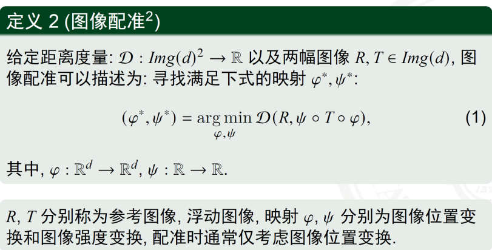


### 基于灰度的配准

特征空间： 灰度值等统计信息

相似性度量： 互相关方法等

优点： 实现简单、通常不需要复杂的预处理、常用于模板匹配

缺点： 适用范围有限（非线性形变）、计算量大（高分辨率/大尺寸）

### 基于特征的配准


匹配的特征点的性质：验证几何上是否一致（在空间变换中是同一个点）  


### 最小二乘方法配准


即这里 $(A^TA)^{-1}A^Tb$。


